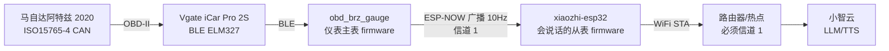

# 项目迭代日志 —— 两个项目的结构 / 功能 / 缺陷修复（复盘用）

> 建立日期：2026-09-14
> 用途：**后续更新前的复盘基线**。想知道"现在是什么结构、改过什么、修过什么坑、哪些路走不通"，从这一篇开始。
> 定位：与 `17-会说话的从表-实现与验证状态.md`（专题深挖）互补 —— 本篇是**全局索引 + 变更台账**，`17` 是其中某一项的细节。

---

## 〇、两个项目是什么关系



| | **obd_brz_gauge**（仪表主表） | **xiaozhi-esp32**（会说话的从表） |
|---|---|---|
| 角色 | 读 OBD、画仪表、广播车况 | 收车况、判断阈值、出声告警、语音问答 |
| 主要外设 | ST77916 圆屏 + 触摸、BLE 连 ELM327 | ST77916 圆屏、I2S 音频、WiFi 上云 |
| 是否连路由器 | **不连**（信道硬编码 1） | **必须连**（要上云）← 信道冲突的根源 |
| 代码来源 | 上游 `steveEcode/obd_brz_gauge` 快照 | 上游 `78/xiaozhi-esp32` v2.5.0 源码 |
| 本次改动 | **无**（只读用，作为移植依据） | **有**（新增从表模块 + 独立板型） |

> 关键点：**主表代码本次没改过**。所有改动都在 xiaozhi 侧。主表源码是从 GitHub 拉的快照，用作协议对齐依据。

---

## 一、迭代时间线（按发生顺序）

### 阶段 1 · 2026-09-13 傍晚｜仪表主线打通

| # | 迭代 | 结果 | 证据 |
|---|---|---|---|
| 1 | 板子到货，确认是**触摸版**（SKU 28514） | ✅ | 出厂固件触摸有反应 |
| 2 | 定位串口 `COM3`（USB-Serial/JTAG），`flash-id` 通过 | ✅ | ESP32-S3 rev v0.2 / 16MB flash / 8MB PSRAM / MAC `28:84:85:91:9a:04` |
| 3 | **整片备份出厂固件**（16MB） | ✅ | `backup/factory-16MB.bin` |
| 4 | 烧录上游预编译仪表固件（bootmedia `0xA20000`，5 个 bin 全部校验） | ✅ | 首启自检通过，BLE 广播 `SkyGauge-9A04` |
| 5 | 屏幕 + 触摸实测 | ✅ | |
| 6 | WiFi OTA 通道端到端（热点 `OBD-Gauge-OTA-9A05`） | ✅ | `/ota/discover`、`/ota/info` 均通 |
| 7 | 自定义主题（TURBO PRO）烧录并加载 | ✅ | `开发参考/12`、`13` |
| 8 | 再次整片备份（此时设备已是仪表固件） | ✅ | `backup/obd-gauge-current-before-xiaozhi-16MB.bin` |

> 📌 **这一步的备份是整个项目的安全网**：改小智前把当时的整片 flash 存下来了，任何时候都能刷回去。

### 阶段 2 · 2026-09-13 夜 → 09-14 凌晨｜移植从表（会话被中断）

| # | 迭代 | 结果 | 证据 |
|---|---|---|---|
| 9 | 源码级分析信道冲突，定方案①（AP 设成信道 1） | ✅ | `开发参考/07` |
| 10 | 拉上游源码快照（`bsp_obd_dsp` + `app_obd_dsp` 共 46 文件） | ✅ | `obd_brz_gauge/src/_provenance.json` |
| 11 | 安装 ESP-IDF v6.1 到 `D:\esp` | ✅ | `backup/idf-install.log` |
| 12 | 首次烧官方小智固件（1.85）验证硬件 | ✅ | `backup/xiaozhi-first-boot-1.85.txt` |
| 13 | **移植从表**：新建 `main/espnow_slave/`（4 个模块 / 8 个文件） | ✅ | 见第 2.3 节 |
| 14 | **新建独立板型** `esp32-s3-touch-lcd-1.85-atzgauge` | ✅ | 引脚与官方板型**逐字节一致** |
| 15 | 段①串口打印数据通路自检通过 | ✅ | `xiaozhi-atzgauge-boot-selftest.txt` |
| 16 | 段②阈值规则 + 本地音频告警自检通过 | ✅ | `xiaozhi-caralarm-selftest.txt` |
| 17 | ⚠️ **会话被误操作关闭（DSH 被关）** | 中断 | — |

### 阶段 3 · 09-14 凌晨｜接手、全流程复核、补诊断（当前会话）

| # | 迭代 | 结果 |
|---|---|---|
| 18 | 复盘中断点，确认代码已在、缺的是验证 | ✅ |
| 19 | **修 `build.py` 板型参数 bug**（短名 → 必须 `厂商/目录名`） | ✅ 见缺陷 #1 |
| 20 | 从零 clean build 证明可复现（2236 目标全重编） | ✅ |
| 21 | 烧录 + 抓全新启动日志，**段①②③ 全部复验通过** | ✅ `boot-log-20260914-012104.txt` |
| 22 | **新增信道诊断**（mismatch 计数 + 监视任务 + 接进 MCP） | ✅ 见功能 #5 |
| 23 | 新增工具 `boot-log.ps1`、`flash-atzgauge.bat` | ✅ 见第五节 |
| 24 | 试做「触摸弹簧抖动」表情 | ❌ **实测手感不行，已全部回滚**（见第六节） |
| 25 | 表情包换 128px 高清素材 | ✅ |
| 26 | **打包全量存档** | ✅ `AtzGauge-archive-20260914-0231.zip` |

### 阶段 4 · 09-14 晚｜点屏开始对话（触摸唤醒）

| # | 迭代 | 结果 |
|---|---|---|
| 27 | 清理上一轮遗留的 Hindsight 本地记忆库（插件/数据/缓存/环境变量） | ✅ 释放约 3.5 GB |
| 28 | 实现**点屏开始对话**：CST816S 独立轮询任务 → `ToggleChatState()`，仅 `idle` 触发 | ✅ 见功能 #6 |
| 29 | 首次烧录实测：探测应答 + 两次点击触发 `idle → connecting → listening` | ✅ **功能链路验证通过** |
| 30 | 修 `esp_lcd_panel_io` 把正常 NACK 打成 ERROR 的刷屏（45s / 1094 行） | ✅ 见缺陷 #8 |
| 31 | 驱动改为**两条候选总线自动探测**，找不到就整体禁用 | ✅ 见缺陷 #9/#10 与功能 #6 |
| 32 | ⚠️ 后续烧录后 **CST816S 完全不应答 I2C**（两总线 / 两 API / 复位脉冲 / 断电均无效） | ⏳ **硬件待查**（FPC 排线），功能已自动禁用 |

### 阶段 5 · 09-14 深夜｜主界面 UI 定制 + 官方升级维护套件

| # | 迭代 | 结果 |
|---|---|---|
| 33 | 摸清上游 UI 接缝：`LvglTheme` / `LvglThemeManager::RegisterTheme()` / `self.screen.set_theme`（写入 NVS，重启仍生效） | ✅ 决定"注册命名主题"而不是改上游 UI 代码 |
| 34 | 新增 **主题包** `atz-night` / `atz-day` / `atz-amber` | ✅ 见功能 #9 |
| 35 | 新增**主界面车况常显条**（无数据/数据过期整条隐藏，不显示假值） | ✅ 见功能 #9 |
| 36 | 新增两个**语音控制工具** `self.ui.set_theme` / `self.ui.set_car_bar`（写 NVS） | ✅ |
| 37 | 字号档位 16 → 20px（板型块内一行可回退） | ✅ |
| 38 | 主题一次性迁移：老设备 NVS 里是上游默认 `light`（白底），首次运行自动切到 `atz-night` 并置标记 | ✅ |
| 39 | 建立**官方升级维护套件** `mods-atzgauge\`：patch + 台账 + 一键重打 + 校验脚本 | ✅ 见功能 #10 |
| 40 | 把散落的上游改动**收敛成 2 个连续块**（源码/include/`esp_wifi` 合并进一个 `list(APPEND)` 块） | ✅ CMakeLists 由 3 处散布 → 2 块 |
| 41 | 修板级 `InitializeTca9554()` 里 6 行乱码注释，并恢复被注释吞掉的 `ESP_ERROR_CHECK(ret)` | ✅ 见缺陷 #11 |
| 42 | 实测：纯净上游 v2.5.0 + 套件 → 重建树与当前树**逐字节一致**（无损） | ✅ 升级路径已验证 |

### 阶段 6 · 09-15 凌晨｜黑屏事故与回落官方界面

| # | 迭代 | 结果 |
|---|---|---|
| 43 | 用户报"屏幕啥也不显示（背光亮着）" | ⚠️ 阻塞 |
| 44 | 加**本机截图端点**（`/shot.jpg`）以便自己看屏幕 | ✅ 见功能 #11 |
| 45 | 发现截图正常、面板全黑 → 定位到"显示初始化后又脉冲了 EXIO1" | ✅ 见缺陷 #12 |
| 46 | 顺手修好两处真实缺陷：**表情集没挂到自定义主题**（导致只有 40px 字体图标兜底）、**车况条与字幕栏只差 1px** | ✅ 缺陷 #13/#14 |
| 47 | 按用户要求**回落官方原版界面**：新增 `ATZ_UI_ENABLE` 总开关，置 0 = `SpiLcdDisplay` + 上游 light 主题，并把 NVS 主题复位 | ✅ 屏幕恢复（用户确认：白底+时钟+表情） |
| 48 | 重生成升级套件（新增 17 文件 / 24 项校验），复验仍逐字节一致 | ✅ |

### 阶段 7 · 09-15 深夜 → 09-16 凌晨｜车况页、尺寸可调、时钟改真字体、卡死事故

| # | 迭代 | 结果 |
|---|---|---|
| 49 | 新建**「车况」整屏页面** `atz_car_page.cc/.h`：ESP-NOW 主表 10Hz 的 10 个字段整屏显示（转速/车速/水温/油温/进气/负荷/节气门/电压/油压/空燃比），300ms 刷新、2s 无数据转灰 | ✅ 截图 `backup\carpage-final.jpg` |
| 50 | 语音进出车况页：MCP 工具 `self.ui.show_car_page` / `self.ui.hide_car_page`（"显示车况"），BOOT 键也可退出 | ✅ 已注册（**云端大模型的实际触发尚未实测**） |
| 51 | 尺寸**可调可控**：表情 125%、时间 140%；新增 `/size?emoji=&clock=` 端点即时生效 + `tools\measure-sizes.mjs` 自动量真实像素 | ✅ 见 `20` 第五节 |
| 52 | 顶部时间从"位图放大"改为**真 30px 字体**（`font_noto_sans_basic_30_4`）：原来是 20px 位图拉伸 → 发虚；现在 74×22 px 且**清晰** | ✅ 本地实测 |
| 53 | **圆形屏遮挡修正**：上游顶栏整宽 360 → 两端图标落在圆外（WiFi 图标实测 x=8..27，等于不可见）；改居中短条 180 + 状态文字下移到 y=28，字幕收窄到 200 并上移 20px | ✅ 见 `20` 第四节 |
| 54 | 用户报"点击屏幕没反应" → 复核触摸：确认是**上一轮我自己改坏了读取路径**（缺陷 #16）并已恢复 | ✅ 触摸唤醒恢复 |
| 55 | 用户报"时钟一直不出来、屏幕停在登录服务器…" → 定位到**我新增的 `SetStatus()` 没有加显示锁**（缺陷 #17，阻塞级） | ✅ 修复并复验：20 秒日志 0 条看门狗、屏幕恢复刷新 |
| 56 | 新增 `20-界面元素清单与页面清单.md`：把每个元素的**内部名/位置/作用/定义位置**、页面清单、尺寸实测值、圆形屏几何固化成表，便于后续用"元素名"精确下达修改 | ✅ |
| 57 | 重生成升级套件（21 文件 / 28 项校验全过） | ✅ |

### 阶段 8 · 09-16 凌晨｜时钟滚动、WiFi 图标、转速外圈、车况页字段语音开关

| # | 迭代 | 结果 |
|---|---|---|
| 58 | 用户报"主界面时间在上下滚动" → 定位为**换字体没同步控件高度**（缺陷 #18） | ✅ 修复；连拍 3 帧**逐像素完全一致**（确实不再滚） |
| 59 | 顶栏 WiFi 图标默认隐藏（`ATZ_SHOW_NETWORK_ICON=0`）；新增语音工具 `self.ui.set_status_icon`（wifi/battery，写 NVS） | ✅ 截图确认顶栏只剩时钟 |
| 60 | 新增**屏幕外沿转速圈** `atz_rpm_ring.cc/.h`（参考 obd_brz_gauge）：最外沿 5px 细圈 + 跟转速走的弧，5500 转琥珀 / 6500 转红，2 秒无数据归零变暗 | ✅ 实测弧随注入转速变化（角度 324°→326°→330°→332°） |
| 61 | **车况页改 flex 流式布局** + 字段开关：语音「我不想看进气」即可关掉，界面自动重排不留空位；设置写 NVS | ✅ 关掉进气+负荷 / 只留三项 两种情形均截图验证 |
| 62 | 车况页主数值改用真 30px 字体（原来是 `transform_zoom` 拉伸位图） | ✅ 与顶部时钟同一套做法 |
| 63 | 台架端点扩展：`/carpage?off=intake`、`?on=load`、`?fields=rpm,coolant,oil`（等价语音操作） | ✅ 已用于本轮验证 |
| 64 | 重生成升级套件 | ✅ |
| 65 | 台架**转速扫掠模拟**：`atz_ui_car_rev_sim()` —— 10Hz 注入 8 秒循环的真车曲线（怠速游车→拉转速→顶一下→松油门换挡→再拉→回怠速），峰值 6400（琥珀区）/ 可选 7000（越红线、会触发音频告警）；车速/水温/油温/负荷/节气门/电压跟着动 | ✅ `/carbar?seconds=300&mode=rev`；实测弧长随转速 42°→48°→78°→124°→172°→满圈，峰值段变琥珀 |
| 66 | 语音工具 `self.ui.car_bar_demo` 增加 `mode` 参数（`demo` / `rev` / `redline`） | ✅ |

### 阶段 9 · 09-16 凌晨｜语音没反应、环变成"一个"、流畅度优化

| # | 迭代 | 结果 |
|---|---|---|
| 67 | 用户报"模拟一下转速并没有触发" → 查到**语音工具被编译开关吃掉**（缺陷 #19）：`atz_ui_register_tools()` 整段调用被 `#if ATZ_UI_ENABLE` 包住，而当时 `ATZ_UI_ENABLE=0` → `self.ui.car_bar_demo` / `self.ui.set_status_icon` **根本没注册** | ✅ 拆开：与界面定制无关的工具改为无条件注册，只有 `set_theme`/`set_car_bar` 留在宏里；启动日志确认 `Add tool: self.ui.car_bar_demo` |
| 68 | 用户指出环"看着有两条" → 改成**一个环**：去掉单独的白边圈，参数照抄 obd_brz_gauge 的 RPM 弧（**直径 340 / 线宽 20**），整圈=底槽、点亮段=指示弧 | ✅ 实测 9 点方向环厚 **20 px**、外缘贴屏幕边 |
| 69 | **流畅度优化**（用户："动画非常卡"）：① 用 `lv_anim` 在两次数据之间插值（10Hz 数据 → ~30fps 运动）② 加死区（变化 <20rpm 不重绘）③ LVGL 渲染任务优先级 **1 → 3** ④ LVGL 刷新周期 **33ms → 16ms** | ✅ 实测：扫掠时 **8.1 fps → 27.5~28.5 fps**，单帧耗时 **12.7ms → 4.2~5.8ms**，空闲 **0 帧/6 秒**（完全不动就不重绘） |
| 70 | 新增 `/perf` 端点：直接读 LVGL 的渲染事件，给出真实帧率/单帧耗时/环重绘次数（**先量化再优化**，不再靠"看着挺顺"） | ✅ 见 `20` 第七节 |
| 71 | 重生成升级套件 | ✅ |

### 阶段 10 · 09-16 凌晨｜60fps、贴边加厚、逐字贴弧、几何总表

| # | 迭代 | 结果 |
|---|---|---|
| 72 | 用户要"更流畅" → 查到**两个真瓶颈**：① 插值用的 `lv_anim` 被 LVGL 编译期动画周期（`LV_DEF_REFR_PERIOD=33ms`）锁在 ~30fps；② `esp_lvgl_port` 的任务循环里有一句 `vTaskDelay(1)`，而本项目 **FreeRTOS tick = 100Hz** → 每轮固定多睡 **10ms** | ✅ 改为**自己做插值**（12ms 步进，指数逼近）+ 板级 `sdkconfig_append: CONFIG_FREERTOS_HZ=1000` |
| 73 | 帧率实测：**8.1 fps → 33 fps → 56.5 fps**，单帧耗时 12.7ms → **4.1~4.6ms**，空闲仍 0 帧 | ✅ `/perf` 可复核 |
| 74 | 用户指出"环没贴屏幕边、还要再厚点" → 根因：**LVGL 的弧是从半径往内画的**，直径 340 时实际只占半径 150~170（离边 10px） | ✅ 直径改 **360**、线宽改 **26** → 实测占 x=0..25（贴边） |
| 75 | 用户报"模拟停不下来" → 之前我给的 300 秒模拟太长，且没有停车入口 | ✅ 单次上限收到 120s；新增 `/carbar?mode=stop` 与语音 `mode="stop"`，实测停车后 0 帧 |
| 76 | **逐字贴弧字幕**（`atz_arc_text.cc`）：整句拆字沿 R=138 圆弧排布、逐字旋到切线方向，上游直线字幕自动隐藏 | ✅ 实测 10 字排布正确（见 `21` 第 4.2 节） |
| 77 | 时钟下移 5px（`ATZ_CLOCK_Y_NUDGE`） | ✅ 实测 y=33（原 28） |
| 78 | 新增 **`/layout` 端点**：把整棵 LVGL 控件树带真实坐标 dump 出来；新增 `/subtitle`（塞字幕验证排版） | ✅ 几何总表 `21-界面几何总表（实测）.md` 就是它导出来的 |
| 79 | 重生成升级套件 | ✅ |

### 阶段 11 · 09-16 上午｜环彻底贴死、字幕回退直线版

| # | 迭代 | 结果 |
|---|---|---|
| 80 | 用户："环里边缘还有好几个像素的距离，要求完全贴死" → 先做**逐像素扫描**（左/上/下三条中线各扫 8~34 像素） | 实测外缘已经在 **x=0 / y=0 / y=359**（帧缓冲最外圈），软件已无处可让 |
| 81 | 判断"看着有缝"的真因：**底槽不透明度只有 40/255**，浅色主题下几乎是白的，眼睛只把暗色那段当"环" | ✅ 底槽不透明度 40 → **90**，整圈清清楚楚 |
| 82 | 双保险：环**故意画到屏幕外**（直径 360 → **380**，线宽 26 → 36，可见部分仍 154~180）→ 外缘被面板裁掉，任何情况下都不可能再有缝 | ✅ 复测：x=0/y=0/y=359 全是环的颜色 |
| 83 | 用户："语音对话卡顿、字幕显示不全" → **关掉逐字贴弧字幕**（`ATZ_ARC_TEXT_ENABLE 0`），回退上游直线字幕 | ✅ 代码保留（可一键开回），默认关闭 |
| 84 | 环在**非空闲状态**（连接/聆听/说话）自动降载到 1/3 频率（`ATZ_RPM_RING_BUSY_DIV 3`），把 CPU/总线让给音频 | ✅ 空闲全速 12ms 插值，对话时 ≈28fps |
| 85 | 加厚后的环会压住字幕两端 → 字幕限宽 200 → **160**、上移 20 → **36**，让字幕待在环内侧 | ✅ 截图确认字幕不再与环重叠 |
| 86 | 重生成升级套件 | ✅ |

### 阶段 12 · 09-16 上午｜白条根因、帧率再提、几何表补全

| # | 迭代 | 结果 |
|---|---|---|
| 87 | 用户报"环面上有个小白条" → 先做**归因实验**：切主题强制整屏重绘后再截图，白条**依然存在** → 是真控件不是残像；再算合成公式（α≈0.40 灰色叠加）→ 判定是 **LVGL 的滚动条** | ✅ 见缺陷 #21 |
| 88 | 根因：转速环被我故意做成 **380×380（比屏幕大）**，把屏幕的"可滚动内容"撑大了 → LVGL 在屏幕底部画滚动条，正好压在环上 | ✅ 环加 `LV_OBJ_FLAG_FLOATING`（浮动对象不计入父级滚动范围）+ 屏幕关掉 SCROLLABLE；复查 y=344~359 全为背景色 |
| 89 | 帧率再提升：`/perf` 增加**重绘面积**统计（读 LVGL 私有的失效区域）→ 实测**平均每帧只重绘 2641 px**，说明瓶颈是"帧节奏"不是"画得多" | ✅ 数据驱动，不再猜 |
| 90 | 节拍压紧：插值步进 12 → **8 ms**，LVGL 刷新周期 4 → **2 ms** | ✅ 帧率 **56.8 → 73.3 fps**（空闲仍是 0 帧） |
| 91 | 重生成升级套件 | ✅ |

### 阶段 13 · 09-16 晚｜语音开关转速环、按 obd_brz_gauge 重做环、PC 模拟台、socket 事故

| # | 迭代 | 结果 |
|---|---|---|
| 92 | **转速环语音开关**：`self.ui.set_rpm_ring(enabled)`（写 NVS 重启仍生效）+ 等价端点 `/ring?enabled=` | ✅ 实测 `/ring?enabled=0` 后截图环消失（6.7KB vs 13.1KB） |
| 93 | **按 obd_brz_gauge 的转速页重做外观**（参照 `ui_ScreenPageRpm.c`）：外沿 **10px 细环**（`create_ring(page,10)`）+ 内侧 **340×340 / 20px / 直角** 的转速弧，底槽压暗、指示弧用主题色 | ✅ 删掉了先前那条 4px 内侧红区刻度（用户明确不要），日志：`d=340 w=20 ... rounded=0 bezel=1` |
| 94 | 帧率再提：插值步进 8 → **6 ms** | ✅ 扫掠实测 **82~83 fps** |
| 95 | **PC 端「车况模拟台」** `tools/sim-console.mjs`：网页界面，滑块/预设/扫掠/设备屏幕实时预览，零依赖单文件 | ✅ 已端到端实测（页面/代理/注入/截屏） |
| 96 | 新端点 `/inject`：把一条合成车况喂进**与真主表完全相同**的链路 | ✅ |
| 97 | 用户报"开了模拟台后喊小智没反应" → 定位为 **socket 耗尽**（缺陷 #22）：三层修复（httpd 限 2 个 socket + `/inject` 改保持语义 + PC 单实例守卫） | ✅ 10Hz 压测 51 次 0 失败、无 accept 报错 |
| 98 | 重生成升级套件 | ✅ |

### 阶段 14 · 09-16 深夜｜四项优化（省 CPU、防乱改、视觉告警、自动调光）

| # | 优化 | 实测结果 |
|---|---|---|
| 99 | **字幕冻结**（省掉空闲时白烧的 CPU）：上游字幕是 `LONG_SCROLL_CIRCULAR`，**文本比框宽就永远滚**。现在新字幕先滚 8 秒，之后切成 CLIP 停住；来新字幕自动解冻 | ✅ 滚动期 **28.5 fps / 7656 px 每帧** → 冻结后 **0 帧**（实测省下约 14% 常年 CPU） |
| 100 | **`/perf` 改非阻塞**：以前在 HTTP 回调里 `vTaskDelay(N)` —— 把 1/3 个 socket 占死 N 秒；现在后台任务每 2 秒算一次窗口，端点只回上次结果（新增 `age=` 表明新鲜度） | ✅ 响应 **6 秒 → 161 ms** |
| 101 | **动态帧率**：转速变化慢时自动降到 1/3 帧率（`ATZ_RPM_RING_SLOW_DELTA/DIV`） | ✅ 慢变 **12 fps / 465 px**，快变回到全速（混合窗口 39 fps / 2210 px） |
| 102 | **socket 池 10 → 16**（板型 `sdkconfig_append`）+ 调试服务放到 3 个 | ✅ 与缺陷 #22 配套，彻底留足云连接预算 |
| 103 | **调试端点鉴权**：7 个写操作（`/theme /carbar /carpage /size /inject /ring /subtitle`）必须带 `&key=<ATZ_DEBUG_TOKEN>`；只读端点不受影响；PC 模拟台自动从 `atz_ui_config.h` 读 token | ✅ 不带 key 被拒、带 key 通过、`/health` 照常 |
| 104 | **视觉告警**：轮询 `car_alarm_active()`，有告警时**外沿细环按 3Hz 闪红**，解除后再补闪 3 秒 | ✅ 注入 7000 转 → 日志 `visual alert: ring flashing (RPM HIGH)`，两张截图分别拍到红色 `(247,56,46)` 与正常黑 `(0,1,0)` |
| 105 | **自动调光**（新模块 `atz_dim.cc`）：只动背光不切主题；空闲 120 秒降亮，夜间（22:00-06:00，需 NTP 时间）再降一档；触摸/对话立刻恢复全亮 | ✅ 日志 `backlight -> 10% (night + idle)` |
| 106 | 重生成升级套件 | ✅ |

### 阶段 15 · 09-17 凌晨｜换挡提示灯、行程统计、按键手势

| # | 新功能 | 实测 |
|---|---|---|
| 107 | **换挡提示灯**：转速到阈值 → 外沿细环闪**青绿**（ATZ_SHIFT_HZ 6，比告警闪得快）。语音「换挡提示设到 6800」→ self.ui.set_shift_light(rpm)，写 NVS；**告警红优先于换挡青绿**（同时发生时不能把故障当换挡） | ✅ 注入 7000 转后细环取色 (0,255,131) = 提示色；只读查询 /ring 不需要 key，带 shift= 才需要 |
| 108 | **行程统计与峰值保持**（新模块 tz_trip.cc）：最高转速/车速/水温/油温/进气/负荷、最低电压、**里程估算**（对车速积分）、**超换挡阈值累计秒数**。RAM 累加 + 每 60 秒写 NVS，断电最多丢 1 分钟；脏数据门控（主表 2 秒无数据就停统计，避免把哨兵值当峰值） | ✅ 注入 7200rpm/110km/h/104°C/118°C 后统计正确：max rpm=7200 … distance~0.27km, above 6800: 5s |
| 109 | 车况页底部加**峰值一行**（"峰值 7000 rpm / 98 C / 112 C"）；语音工具 self.car.get_trip（问"最高水温多少"）与 self.car.reset_trip（"行程清零"）；台架端点 /trip | ✅ 截图确认车况页出现峰值行 |
| 110 | **BOOT 键多手势**：单击=原逻辑（配网/关车况页/开口），**双击=静音切换**，**长按 2 秒=循环切主题**（light↔dark；ATZ_UI_ENABLE=1 时带上 atz-* 三套） | ⚠️ 代码按上游 iot_button 同一套回调写法，**但按键手势必须真人按一下才能确认**（无法用软件模拟 GPIO） |
| 111 | 重生成升级套件 | ✅ |

### 阶段 16 · 09-17 凌晨｜用户实机反馈后的"减法"：删换挡灯/转速环、行程独立页、关自动调光

> 用户原话："换挡提示灯删除掉吧、转速环也删除掉 / 行程统计 + 峰值保持 为车况页面第二页之类的、或单独页面、可以通过语音开始记录、重置记录之类的？/ 同时自动亮度也是不需要、因为亮度总是在变很不舒服"
> 这一轮**主要是删功能**，但删出来的坑比加功能还多（见缺陷 #23/#24/#25）。

| # | 变更 | 实测结果 |
|---|---|---|
| 112 | **删除换挡提示灯**：`ATZ_SHIFT_*` 五个宏、细环闪绿逻辑、NVS 键 `shift_rpm`、语音工具 `self.ui.set_shift_light`、`/ring?shift=` 全部移除 | ✅ 编译期就消失；`/ring` 变只读端点，回 `ring compiled_in=0` |
| 113 | **删除转速环**：`ATZ_RPM_RING_ENABLE=0`，环代码整块编译不进固件；语音工具 `self.ui.set_rpm_ring` 一并删除 | ✅ 启动日志无环、`/ring` 回 `enabled=0 visible=0`；主界面回到"表情+时钟+字幕"的原版观感 |
| 114 | **`/perf` 的统计搬家**：帧率/单帧耗时/重绘像素原来寄生在 `atz_rpm_ring.cc` —— 环一删，`/perf` 会**静默变成全 0**（工具坏了但看不出来）。新建 `atz_perf.cc/.h` 独立承载，在 `AtzLcdDisplay::SetupUI()` 里 `atz_perf_init()` | ✅ 关掉环之后 `/perf` 依旧有数：空闲 0 帧、车况页刷新时 3.0 fps / 19.3 ms / 27430 px |
| 115 | **行程统计升级为「车况页第二页」**：新页含状态行（● 记录中/● 已暂停 + 已记录时长）、6 张数据卡（里程/转速/车速/水温/油温/电压）、两个可点按钮（开始记录·暂停记录 / 清零重来）。**翻页**：点一下屏幕 或 语音「看行程统计」→ `self.ui.show_trip_page` / `self.ui.set_car_page_page(page)` | ✅ 截图确认两页各自干净；`/carpage?page=1` 与 `/carpage?page=0` 往返无叠加 |
| 116 | **记录默认关 + 语音开始/暂停/清零**：`ATZ_TRIP_RECORD_DEFAULT=0`；`self.car.set_trip_recording(recording=true/false)`、`self.car.reset_trip`（清零并立刻开始记录）。停止**不清零**（数字原地停住，重新开始接着累加） | ✅ 暂停 6 秒 samples/session 完全不变；恢复后继续增长；重启后 `recording=0` 但峰值保留 |
| 117 | **关闭自动调光**：`ATZ_DIM_ENABLE=0`（代码与参数留着，改回 1 即恢复）。理由：亮度自己变很干扰 | ✅ 背光只在启动时设一次，之后不再被改 |
| 118 | 新功能 `hot_s`（转速 ≥ `ATZ_TRIP_HOT_RPM`=6500 的累计秒数）替代原来"超换挡阈值时长"；`ATZ_TRIP_AUTO_STOP_S` 未实现则**不留在配置里**（不给假开关） | ✅ `/trip` 显示 `above 6500 rpm: 16 s` |
| 119 | 重生成升级套件 | ✅ |

### 阶段 17 · 09-17 凌晨｜用户实机反馈：两页排版重叠 + **按钮点不动**（根因级修复）

> 用户原话："车况页和行程统计页的UI都有重叠的地方、请重新优化UI、修复排版问题、两个按钮貌似也点不动"

| # | 变更 | 实测结果 |
|---|---|---|
| 120 | **★ 按钮点不动的根因**：全工程**没有任何 `lv_indev_create`** —— 触摸是板级 `TouchPollTask` 自己轮询 CST816S 读到的（不能交给 esp_lvgl_port，休眠的 CST816S 会 NACK，而它对每次读都 `ESP_ERROR_CHECK` → 开机重启循环，见文档 17 §9）。所以 `lv_button` 的 `LV_EVENT_CLICKED` **永远不可能触发**。新增 `atz_hit_zone.cc/.h`：矩形点击区注册表 + 命中判定，触摸任务拿到 x/y 后自己算 | ✅ `/tap?x=115&y=51` → `zone=1 [trip.record]` → `recording` 翻转；`/tap?x=243&y=51` → 清零生效 |
| 121 | 触摸任务开始**解析坐标**（第 2..5 字节的 12 位 X/Y）；命中区时执行回调（回调自己加显示锁），**没命中就什么都不做**（旧版是"点一下翻页"，会和按按钮抢） | ✅ 点数据区 (`179,90`) → `zone=-1`，不误触发任何东西 |
| 122 | 翻页改成**自己的点击区**：车况页底部提示条 → 行程页；行程页底部提示条 → 车况页。两页那条区域**坐标相同**，用"点击区启用/停用"（`atz_hit_zone_set_enabled`）互斥 | ✅ 两页往返都正确，不会互相抢 |
| 123 | **排版重叠修复**：车况页「检查主表与信道」与「点一下看行程」原来相差 **2px**（y=329 vs 331）→ 现在 y=296 / y=326 各占一行；行程页「● 行程」标题（y=9..40）与「● 记录中」（y=2..33）两行挤在一起 → **行程页藏掉顶部标题**；行程页标题下移到 y=4、按钮行保持 y=38 | ✅ `/layout` 复核：三个文本块 y 区间互不相交（4..34 / 38..63 / 104..261 / 326..356） |
| 124 | 按钮加大：120×**26**（原 22），点击区再向外扩 6px（左右）/4px（上下）；新增 `/tap` 端点（合成一次点击，不碰硬件）与 `/touch` 报告**坐标 + 命中区列表** | ✅ `/touch` 回 `last point=(x,y) range x=…`，一次就能分清"面板没答/坐标落在按钮外/坐标系不对" |
| 125 | 重生成升级套件 | ✅ |

### 阶段 18 · 09-17 凌晨｜实机反馈第二轮：时间不跳、UI 出圆、主界面残留 rpm

> 用户原话："点击下去有反应、但是时间不会跳动、且UI有点超出屏幕" + "有时候主界面下面会一直显示rpm什么的是什么问题"
> 上一轮我只验证了"合成点击能触发回调"，**没验证真手指落点**。这一轮用户把 `/touch` 自检结果贴回来：
> `last point=(76,56) range x=63..98 y=48..64 hit-zone samples=9, last zone=trip.record`
> → **面板坐标与显示坐标 1:1，真手指命中正确**（触点判定这条链路到此完全闭环）。

| # | 变更 | 实测结果 |
|---|---|---|
| 126 | **修行程时长不跳**（缺陷 #30）：时长累加从"数据新鲜"分支里提出来，只要在记录就按 dt 走 | ✅ 无主表数据下点开始：6 s → 11 s 正常跳动 |
| 127 | **修 UI 出圆**（缺陷 #31）：写了个"四角到圆心距离"的检查脚本，先量出两页共 9 处出圆；再把"元素放得下"当**约束求解**（穷举 y 求四角都在 R=180 内的区间，留 4px 余量），按解出的区间重排两页 | ✅ 132 个可见控件复查：**文字控件 0 出圆** |
| 128 | 车况页新几何：内容列 232 宽（两格 108）/ 起点 y=56 / 底部两行提示 y=276、308 | ✅ 截图：转速车速 + 8 个字段 + 「行程统计」提示，全部在圆内 |
| 129 | 行程页新几何：状态行 y=2、按钮行 208×26 @ y=38、卡片 **2 列 × 168 × 单行** @ y=122、底部「返回车况 + 时长」@ y=304 | ✅ 截图：6 张卡（里程/转速/车速/水温/油温/电压）不叠字、不出圆 |
| 130 | **修"主界面一直显示 rpm"**（缺陷 #34）：定位到 `Alert()` 的正文是走字幕的 + 告警会重发同一条 + 字幕冻结把它钉住 → 新增 `ATZ_SUBTITLE_HOLD_S=30` 静置自动清空（说话/聆听中不清） | ✅ `/health`、`/layout` 正常；行为待真机对话验证 |
| 131 | 重生成升级套件 | ✅ |

### 阶段 19 · 09-18｜翻页改成左右滑动、修"检查主表与信道"重叠、删掉页面内的翻页按钮

> 用户要求：① 「检查主表与信道」和文字重叠，换个位置；② 翻页改为滑动：
> 主界面左划→车况页、车况页左划→行程页、行程页右划→车况页；③ 删掉车况页的「行程统计」
> 按钮和行程页的「返回车况」按钮。

| # | 变更 | 实测结果 |
|---|---|---|
| 132 | **触摸任务从"按下即触发"改成"抬起时判手势"**：记录起点与过程最大位移，抬起时——位移 < 20px 判**点击**（走命中区）、水平位移 ≥40px 且 ≥2×垂直位移判**滑动**、其它忽略。**为什么必须等抬起**：滑动过程中手指会一路划过很多控件，按下就触发会误按一堆按钮 | ✅ `/tap` 与 `/swipe` 两个合成端点分别验证两条链路 |
| 133 | **滑动手势**（`atz_hit_zone.cc` 新增 `atz_swipe_set_handler/fire/has_handler`）：车况页左划→行程页、行程页右划→车况页、行程页左划/车况页右划不注册（到头了）。**整屏页没显示时两个方向都不注册**，手势落到触摸任务的兜底分支：**主界面左划→打开车况页** | ✅ 逐项验证：主界面(0/0) → 左划进车况 → 车况(LEFT=1) → 左划进行程 → 行程(RIGHT=1) → 左划忽略/右划回车况 → 车况右划忽略 → 隐藏后回 0/0 |
| 134 | **删除两个页面内的翻页按钮**：「▾ 行程统计」（车况页底部）与「▴ 返回车况」（行程页底部）连同点击区一起删掉。行程页的**已记录时长并入状态行**（"记录中 0:06"） | ✅ 点击区从 4 个减到 **2 个**（只剩行程页的开始/暂停、清零） |
| 135 | **「检查主表与信道」挪位**：真凶是**上游低电量弹窗**（`low_battery_popup_`，实测 y=309..339、x=110..249）压在原位置那一带。底部提示行删掉后腾出了空间，把它从 y=276 挪到 **y=308**（四角最远 172.3 ✓，离开数据区） | ✅ `/layout` 复查：车况页可见文本块 y 区间 15..45 / 56..160 / 169..301（数据）/ **308..338**（提示），互不重叠 |
| 136 | 新增台架端点 `/swipe?dir=left\|right`（合成一次滑动，不碰硬件）；`/tap` + `/swipe` 构成"手势链路可离线验证"的工具对 | ✅ |
| 137 | 重生成升级套件 | ✅ |

---

## 二、xiaozhi-esp32 代码结构（改动后）

### 2.1 顶层

```
xiaozhi-esp32/
├── src/                      ← ESP-IDF 工程根
│   ├── main/                 ← 唯一的应用组件（改动集中在这里）
│   ├── managed_components/   ← 组件管理器下载的依赖（可再生，勿手改）
│   ├── partitions/           ← 分区表（v1/v2，16m.csv 等）
│   ├── scripts/              ← build.py 等构建脚本
│   ├── docs/                 ← 上游文档
│   ├── sdkconfig*            ← 生成的配置（勿手改）
│   └── build/                ← 构建产物（可再生，勿手改）
└── firmware/                 ← 上游预编译固件 + _provenance.json
```

### 2.2 `main/` 布局

| 路径 | 谁写的 | 说明 |
|---|---|---|
| `application.cc/.h` | 上游 | 主事件循环、协议生命周期 |
| `device_state_machine.*` | 上游 | 状态机（改状态必须走 `SetDeviceState()`） |
| `mcp_server.cc/.h` | 上游 | MCP 工具注册与派发 |
| `boards/` | 上游 + **本项目新增 1 个板型** | 板级实现 |
| `boards/common/` | 上游 | `Board` 接口与可复用硬件/网络辅助 |
| `display/` | 上游 | `Display` 接口、`LcdDisplay`、LVGL 显示、GIF、主题、表情集合 |
| `audio/` | 上游 | codec、音频任务、唤醒词 |
| `protocols/` | 上游 | WebSocket / MQTT-UDP |
| `assets.cc/.h` | 上游 | 从 assets 分区挂载字体 / 表情 / 主题 |
| **`espnow_slave/`** | **★ 本项目新增** | ESP-NOW 从表接收 + 车况缓存 + 告警 + MCP 工具 |
| `CMakeLists.txt` | 上游 + **本项目改 3 处** | 源文件、include 路径、板型资产选择 |
| `Kconfig.projbuild` | 上游 + **本项目加 1 个 config** | 板型开关 |

### 2.3 ★ 新增模块：`main/espnow_slave/`（8 个文件，非空行合计 **1130 行**）

| 文件 | 非空行 | 职责 | 来源 |
|---|---|---|---|
| `obd_data_cache.h` | 62 | 车况缓存接口 + 无效值哨兵约定 | 上游裁剪 |
| `obd_data_cache.c` | 261 | 车况缓存实现（临界区保护、速度平滑、RPM 覆盖层） | 上游裁剪 |
| `espnow_link.h` | 37 | 从表接收接口 | 上游裁剪 |
| `espnow_link.c` | 413 | **收包核心** + 协议校验 + 信道诊断 + 自检注入 | 上游裁剪 + 新增诊断 |
| `car_alarm.h` | 32 | 阈值规则接口 | **全新** |
| `car_alarm.cc` | 227 | 阈值规则 + 迟滞 + 重报节流 + 本地音频告警 | **全新** |
| `car_status_tool.h` | 11 | MCP 工具注册（C 接口包装） | **全新** |
| `car_status_tool.cc` | 87 | MCP 工具 `self.car.get_status` 实现 | **全新** |

> 行数口径：上表为**非空行**（含空行是 1460 行）。对照上游 `bsp_obd_dsp/espnow_link.c` 为 463 行（含主体+从表两条路径）。

**依赖关系**（刻意做成单向）：

```
espnow_link.c ──收包──▶ obd_data_cache ──读值──▶ car_alarm.cc ──告警──▶ Application::Alert()
      │                                              │
      └──────────────┐                               └──▶ car_status_tool.cc ──▶ 云端 LLM
                     ▼
             板级 .cc（装配 + 生命周期）
```

**为什么砍掉上游的一半**（都写在文件头注释里）：

| 砍掉 | 原因 |
|---|---|
| `calculate_gear()` / 档位 | 依赖 `vehicle_profiles`（整套车型库/齿比表/轮胎半径），且档位对 AI 告警无意义 |
| 里程统计 | 依赖 `nvs_storage`，属仪表功能 |
| RS485 刹车温度 | 阿特兹没有该硬件 |
| 主表 `master_pack()` / `master_task()` | 本板是从表 |
| presence 心跳（默认关） | 主表靠它统计在线从表数并据此决定是否播放三连表开机动画；本板没有仪表位置，发心跳会让主表误判 |
| 联动测试 / 阈值同步 | 上游主表功能，从表不需要 |

### 2.4 ★ 新增板型：`main/boards/waveshare/esp32-s3-touch-lcd-1.85-atzgauge/`

| 文件 | 行数 | 说明 |
|---|---|---|
| `config.h` | 54 | **与官方板型逐字节一致**（已用 FileHash 校验）—— 引脚一个都没改 |
| `config.json` | 11 | `type: esp32-s3-touch-lcd-1.85-atzgauge`（独立 OTA 通道） |
| `esp32-s3-touch-lcd-1.85-atzgauge.cc` | 455 | 板级装配；相对官方板型**只多了 3 件 ESP-NOW 相关的事** |
| `README.md` | 79 | 编译/烧录/运行行为/信道硬约束/已知取舍 |

**为什么另起板型而不是改官方那个**：上游 `AGENTS.md` 明确要求
> Never alter an existing board's pins... **board identity affects OTA compatibility.**

沿用官方板型名会被官方 OTA 静默覆盖，从表功能就没了。

**板型选择链**（改一处必须同步其余，上游 `AGENTS.md` 要求）：
```
config.json → scripts/build.py → main/Kconfig.projbuild → main/CMakeLists.txt → board 源文件 + config.h
```

### 2.5 CMakeLists.txt 的 3 处改动

| 位置 | 改动 |
|---|---|
| `SRCS` | 追加 `espnow_slave/` 下 4 个 **源文件**（`.c/.cc`；头文件不用登记） |
| `INCLUDE_DIRS` | 追加 `espnow_slave` |
| 板型分支 | 新增 `elseif(CONFIG_BOARD_TYPE_..._ATZGAUGE)`：`BOARD_DIR` + 字体 + `DEFAULT_EMOJI_COLLECTION` |

---

## 三、功能变更清单（相对上游 xiaozhi-esp32 v2.5.0）

| # | 功能 | 落点 | 状态 |
|---|---|---|---|
| 1 | **ESP-NOW 从表接收** —— 收主表 10Hz 广播的车况，写入本地缓存 | `espnow_slave/espnow_link.c` | ✅ 已台架验证 |
| 2 | **车况缓存**（水位/油温/进气/负荷/节气门/电压/转速/车速/空燃比） | `espnow_slave/obd_data_cache.c` | ✅ |
| 3 | **阈值规则 + 本地预录音频告警** —— 5 条规则，迟滞 + 重报节流 + 陈旧数据门控 | `espnow_slave/car_alarm.cc` | ✅ 已台架验证（会出声） |
| 4 | **MCP 语音问答** `self.car.get_status` —— 让用户用自然语言问车况 | `espnow_slave/car_status_tool.cc` | ✅ 已注册，待联网实测 |
| 5 | **信道诊断** —— 区分「信道不对」与「主表不在」（详见缺陷 #5 的修法） | `espnow_link.c` + `car_status_tool.cc` | ✅ |
| 6 | **独立板型 + 独立 OTA 通道** | `boards/waveshare/...-atzgauge/` | ✅ |
| 7 | **表情包换 128px 高清素材**（官方 1.85 用 64px，在 360×360 屏上偏小） | `CMakeLists.txt` 一行 | ✅ |
| 8 | **点屏开始对话**（触摸唤醒）—— 点一下屏幕 = 开口说话，**仅在 `idle` 状态触发**；不接 LVGL、独立任务轮询、总线和探测全自动 | 板型 `.cc`：`InitializeTouchWake()` / `TouchTryBus()` / `TouchPollTask()` | ✅ 已实测恢复（`TouchWatch` 边点边测显示 `TOUCH DETECTED`）；中途"点不动"是缺陷 #16 的回归，非硬件 |
| 9 | **主界面 UI 定制**：3 套车机主题（`atz-night` / `atz-day` / `atz-amber`）+ 主界面**车况常显条** + 语音工具 `self.ui.set_theme`、`self.ui.set_car_bar`（均写 NVS，重启仍生效） | 板型目录 `atz_ui_config.h`（**全部可调项**）/ `atz_ui.h` / `atz_ui.cc` | ✅ 编译烧录通过、初始化链路实测无崩溃；视觉待人工确认 |
| 10 | **官方升级维护套件**：相对上游的全部改动台账 + patch + 一键重打/校验脚本 | `xiaozhi-esp32\mods-atzgauge\`（+ 生成器 `tools\gen-mods-kit.mjs`） | ✅ 已实测无损（纯净 v2.5.0 + 套件 = 当前树，逐字节一致） |
| 11 | **本机截图端点**（台架调试）：`http://<设备IP>:8099/` 下 `/shot.jpg`（截图）、`/health`、`/theme?name=`（切主题）、`/carbar?seconds=`（车况条预览）、`/touch`（触摸自检）、`/carpage?action=`（车况页开关） | 板型目录 `atz_shot.cc` / `atz_shot.h`（开关 `ATZ_UI_SHOT_SERVER_ENABLE`） | ✅ 已用于定位黑屏、颜色、触摸三类问题 |
| 12 | **「车况」整屏页面**：语音「显示车况」进入，10 个字段 + 链路状态；超限变色、无数据整页变灰；BOOT 键退出 | 板型目录 `atz_car_page.cc` / `atz_car_page.h`（独立模块，**不受 `ATZ_UI_ENABLE` 影响**） | ✅ 已用截图验证（含合成数据注入） |
| 13 | **尺寸微调（可运行时可调）**：表情图素材 128×121 → **125%（控件框 160×151，截屏可见圆 140×134 = +26%）**；顶部时间 → **换真 30px 字体（截屏实测 74×22，约 +54%，清晰不糊）** | 板型目录 `atz_ui.cc` 的 `ApplySizes()` / `DescribeSizes()` / `SetStatus()`（宏在 `atz_ui_config.h`；运行时控制走 `/size` 端点） | ✅ 已用像素量测验证 |
| 14 | **界面元素与页面清单文档** | `开发参考/20-界面元素清单与页面清单.md` | ✅ |
| 15 | **圆形屏遮挡修正**：上游顶栏整宽 360 / 字幕贴底，两端都落在圆外 → 顶栏改居中 180 短条、状态文字下移、字幕收窄 200 并上移 20px | `atz_ui.cc` 的 `ApplyRoundScreenLayout()`（`ATZ_ROUND_*` 宏，`ATZ_ROUND_ENABLE=0` 可整段关掉） | ✅ 截图确认 WiFi/时钟/字幕均落进可视区 |
| 16 | **顶部时间改真字体**：原做法是 `transform_zoom` 位图拉伸（发虚）；现改成 `HH:MM` 时切到 `font_noto_sans_basic_30_4`，并把位图缩放复位成 256 | `atz_ui.cc` 的 `SetStatus()` | ✅ 清晰；**注意此函数必须持有显示锁，见缺陷 #17** |
| 17 | **顶栏图标可关**：WiFi 图标默认隐藏；语音 `self.ui.set_status_icon`（wifi / battery，写 NVS） | `atz_ui.cc` 的 `ApplyStatusIconVisibilities()` / `SetStatusIconVisible()`；宏 `ATZ_SHOW_NETWORK_ICON` / `ATZ_SHOW_BATTERY_ICON` | ✅ |
| 18 | **屏幕外沿转速圈**（参考 obd_brz_gauge 的仪表外观）：最外沿 5px 细圈 + 跟转速走的弧（0~8000 转满圈；≥5500 琥珀、≥6500 红；2 秒无数据归零变暗），颜色跟随主题 | **新文件** `atz_rpm_ring.cc` / `atz_rpm_ring.h`（`ATZ_RPM_RING_*` 宏；`ATZ_RPM_RING_ENABLE=0` 可关） | ✅ 实测弧随转速实时变化 |
| 19 | **车况页字段可语音开关 + 自动重排**：说「我不想看进气」即可关掉该项，界面不留空位；「只看转速和水温」也行；设置写 NVS | `atz_car_page.cc` 的 flex 布局 + `atz_car_page_set_field(s)`；语音工具 `self.ui.set_car_page_field` / `set_car_page_fields` | ✅ 截图验证两种情形 |

### 告警阈值（`car_alarm.cc`）

| 规则 | 触发 | 解除 | 依据 |
|---|---|---|---|
| 水温过高 | ≥108 °C | ≤102 °C | 正常 85~95 |
| 油温过高 | ≥125 °C | ≤115 °C | 正常 <110，激烈驾驶可到 120 |
| 转速过高 | ≥6500 rpm | ≤6000 rpm | 红线区 |
| 电压过低 | ≤11.5 V | ≥12.0 V | 着车后应 13.5~14.5 V |
| 电压过高 | ≥15.0 V | ≤14.7 V | 调节器异常 |

**三条防误报设计**：①迟滞（越 trigger 才报、回落 clear 才解除）②重报节流（同一告警最短 30s 再出声）③陈旧数据门控（主表 2s 无数据则整体静默，绝不拿过期值报警）。另加**无效值哨兵显式排除**（油温 -100 / 水温 -40 / 转速 0 / 电压 <0）。

### 协议对齐（跨项目契约，改一边必须改另一边）

| 项 | 值 | 备注 |
|---|---|---|
| magic | `0x4F42`（'OB'） | |
| version | `5` | v5 起含 `afr_x100` |
| 包结构 | `espnow_obd_packet_t`，`__attribute__((packed))`，**47 字节** | 字段顺序逐字节比对过，主从完全一致 |
| 广播间隔 | 100ms（10Hz） | 主表定时广播到 `FF:FF:FF:FF:FF:FF` |
| **信道** | **主表硬编码 1**（`bsp_obd_dsp/espnow_link.c` 的 `ESPNOW_CHANNEL`） | ★ 所以路由器必须信道 1 |
| 主表名 | `"SkyGauge"` | 从表会记住并上报 |

---

## 四、缺陷与修复台账

### 缺陷 #1 · `build.py` 板型参数必须带厂商前缀 🔴 阻塞级

| | |
|---|---|
| **现象** | `python scripts/build.py esp32-s3-touch-lcd-1.85-atzgauge` → `[ERROR] board_type ... not found in main/CMakeLists.txt` |
| **根因** | `build.py` 的 `_find_board_config_candidates()` 拿 `set(BOARD_DIR "厂商/目录")` 与传入值做**全等比较**，短名永远匹配不上 |
| **修法** | 参数写全：`waveshare/esp32-s3-touch-lcd-1.85-atzgauge`；并修正板型 README |
| **教训** | 报错信息说"not found in CMakeLists"，但 CMakeLists 里明明有 —— 别信字面意思，去看匹配逻辑 |

### 缺陷 #2 · IDF 6.1 与触摸组件的结构体字段顺序不兼容 🔴 编译级

| | |
|---|---|
| **现象** | `designator order for field 'esp_lcd_panel_io_i2c_config_t::control_phase_bytes' does not match declaration order` |
| **根因** | 组件宏 `ESP_LCD_TOUCH_IO_I2C_CST816S_CONFIG()` 按**旧字段顺序**写；IDF 6.1 把 `on_color_trans_done`/`user_ctx` 提到了 `flags` 之前。C++ 对指定初始化要求顺序与声明一致 |
| **修法** | 不改 `managed_components/`（AGENTS.md 禁止手改生成物），在板级本地按 6.1 顺序写一份等价配置 |
| **备注** | 该修复随触摸功能一起回滚了；将来再接触摸会再遇到 |

### 缺陷 #3 · 表情包在未联网时不挂载 🟡 观感级（已回滚）

| | |
|---|---|
| **现象** | 界面显示的是**字体机器人图标**，不是表情包里的图 |
| **根因** | `Application` 只在 `ActivationTask()` 里调 `CheckAssetsVersion() → assets.Apply()`（`application.cc:364-369`），而它需要联网激活 → **配网模式/未联网时资源根本没挂上**，`SetEmotion()` 查不到图只能退回字体 |
| **曾用修法** | 板级在 `SetupUI()` 里直接 `Assets::GetInstance().Apply()` 挂本地分区 |
| **当前状态** | 按使用者要求**已随表情功能一起回滚**（严格回原版）。所以现在未联网仍看到字体图标，这是**原版行为** |

### 缺陷 #4 · 触摸读失败被 `ESP_ERROR_CHECK` 带走 → 无限重启 🔴 崩溃级（已回滚）

| | |
|---|---|
| **现象** | 板子约每秒重启一次，`abort() was called`，实测 54 次 |
| **根因** | `esp_lvgl_port_touch.c:127` 是 `ESP_ERROR_CHECK(esp_lcd_touch_read_data(...))`；而 CST816S 有相当比例的读会失败（NACK → `ESP_ERR_INVALID_RESPONSE`，**且 NACK 只在 DEBUG 级别打日志、默认看不见**） |
| **辅因** | `lvgl_port_add_touch()` 只要 `int_gpio_num != NC` 就把输入设备切成 `LV_INDEV_MODE_EVENT`（只靠中断、不再轮询） |
| **曾用修法** | 绕开 lvgl_port，板级自己 25ms 轮询：`esp_lcd_panel_io_rx_param(tp_io_, 0x02, d, 5)`，**失败当作"未按下"重试** |
| **当前状态** | 已随触摸功能回滚 |

### 缺陷 #5 · 「信道不对」与「主表不在」无法区分 🟡 排查级（保留）

| | |
|---|---|
| **现象** | 从表收不到数据时，日志里只有沉默，无法判断是信道问题还是主表没开机 |
| **根因** | 原实现只统计"有效包数"，没有统计"收到了但解析失败的帧" |
| **修法** | 新增 `s_rx_mismatch` 计数 + 来源 MAC + `chan_monitor_task`（每 5s 判断一次），判据：**有外来帧却没有效包 → 射频活着、大概率信道不对**；**一个外来帧都没有 → 主表没开或太远**。同一判据接进 MCP，语音问车况时模型能直接说出"多半是信道不对" |
| **状态** | ✅ **保留**（与触摸无关，是纯诊断增强） |

### 缺陷 #6 · 绑定非幂等触发看门狗 🔴 崩溃级（已回滚）

| | |
|---|---|
| **现象** | `task_wdt: IDLE0` 饿死，backtrace 停在 `lv_inv_area` |
| **根因** | 小智**每次状态变化**都调 `SetEmotion()`（`application.cc:1011`）；子类在那里重新绑定，而绑定会写 transform 样式 + 触发重绘 → 状态机一变就打一次重绘 |
| **修法** | 同目标 + 已静止 + 缩放已归位 → 直接返回 |
| **附带发现** | `lv_obj_get_width()` 返回的是**应用 transform 之后**的尺寸 → 必须先归位缩放再量尺寸，否则每切一次表情放大一倍 |
| **当前状态** | 已随触摸功能回滚 |

### 缺陷 #7（自造，被查出来的）· `lv_indev_active()` 用错 🟠 隐蔽级

| | |
|---|---|
| **现象** | "按下"几乎永远检测不到，行为时灵时不灵 |
| **根因** | `lv_indev_active()` 直接返回全局 `indev_active`，而该字段**只在 `lv_indev_read()` 执行期间被赋值、返回前清空**。普通 `lv_timer` 回调里它通常是 NULL；且 `lv_indev_read()` 的提前 return（如切屏动画）会残留非 NULL 值 |
| **修法** | 由板级把真实 `lv_indev_t*` 传进来，不要在定时器里"发现"输入设备 |
| **状态** | 已随触摸功能回滚，但**这个知识点要留着** |

### 缺陷 #8 · panel-IO 把正常 NACK 打成 ERROR 🟡 噪音级（本轮修复）

| | |
|---|---|
| **现象** | 30ms 轮询下 **45 秒刷 1094 行** `E lcd_panel.io.i2c: panel_io_i2c_rx_buffer(149): i2c transaction failed`；日志 102 KB 里绝大部分是它 |
| **根因** | CST816S 空闲休眠时**不应答自己的 I2C 地址**，这是它的正常行为；但 `panel_io_i2c_rx_buffer()` 对每次失败都 `ESP_LOGE`。而 IDF 原生 `i2c_master.c` 对 NACK 只打 `ESP_LOGD`（`s_i2c_err_log_print()` 里还有 `bypass_nack_log` 开关） |
| **修法** | 改用原生 `i2c_master_transmit_receive()`。两条路径底层是同一个调用（panel-IO 只是转调 + 打日志），所以**换的是日志噪音，不是能力**；真实故障（超时/总线忙）仍会打 ERROR |
| **证据** | 换前 `backup/boot-log-20260914-215421.txt`：102003 字节 / 1094 ERROR；换后 `boot-log-20260914-215847.txt`：12268 字节 / **0 ERROR** |

### 缺陷 #9 · `i2c_master_probe()` 在这块板上不可靠 🟠 排查级（本轮发现）

| | |
|---|---|
| **现象** | 用它扫描总线时，**连已知工作正常的 TCA9554（bus0 @0x20）都扫不出来** → 打印"(nothing)" |
| **影响** | 会把"扫描无结果"错误地当成"设备不存在" |
| **修法** | 探测设备一律用**真实寄存器读**（本项目读 CST816S 的 CHIP_ID `0xA7`），不要相信 `i2c_master_probe()` 的否定结论 |

### 缺陷 #10 · 单次探测误判"面板没接" 🟡 排查级（本轮修复）

| | |
|---|---|
| **现象** | 启动日志出现 `CST816S did not answer … may not work`，但面板其实是好的 |
| **根因** | TCA9554 的复位脉冲放开后约 100ms 就去读，芯片还在启动 → NACK |
| **修法** | 探测加退避重试：`TP_PROBE_ATTEMPTS` × `TP_PROBE_GAP_MS`（默认 10 次 × 100ms） |

### 缺陷 #11 · 乱码注释把 `ESP_ERROR_CHECK` 吞进注释 🟠 隐蔽级（本轮修复）

| | |
|---|---|
| **现象** | 板级 `InitializeTca9554()` 里 6 行中文注释是**双重编码乱码**；其中 `esp_io_expander_set_dir(...)`（设 EXIO0/EXIO1 为输出）那行的结尾 `ESP_ERROR_CHECK(ret);` **落在注释里**，等于这个调用从未做错误检查 |
| **根因** | 上一轮从厂商板型文件复制代码时，经 GBK 控制台写盘导致中文双重编码；行尾代码被注释"吃掉"后没人注意 |
| **修法** | 重写该段注释为正确 UTF-8，并把 `ESP_ERROR_CHECK(ret);` 恢复为真实语句（与相邻几行保持一致） |
| **影响面** | 仅错误处理路径：设置方向失败时会静默继续，而不是报错停下 |

### 缺陷 #12 · 显示初始化后再动 EXIO1 → 背光亮、屏全黑 🔴 阻塞级（已修复）

| | |
|---|---|
| **现象** | 屏幕**背光亮着但完全不显示**任何内容（不是关屏）。同一时刻 `lv_snapshot_take` 抓出来的画面却是正常的（WiFi 图标 / 时钟 / 大表情都在）—— 因为快照抓的是 LVGL 帧缓冲，**不等于面板实际显示**。这两件事能同时成立，是本次排查最大的干扰项 |
| **根因** | 为救活不应答的 CST816S，我在 `InitializeTouchWake()` 里给 EXIO1 单独加了一次复位脉冲（拉低 20ms 再放开）。但 `InitializeTca9554()` 是把 **EXIO0/EXIO1 一起**脉冲的（厂商注释：这两根分别复位 LCD 与触摸板），而显示初始化在它**之后**完成。在显示初始化之后再动 EXIO1，等于把已经配好的 LCD 又复位一次 → 面板丢掉初始化序列 → 背光亮、屏全黑 |
| **修法** | 直接删掉这段脉冲（它对触摸问题本来也毫无帮助：两条总线都试过，结果都是 NACK）。并加 **`ATZ_UI_ENABLE` 总开关**：置 0 即回到官方原版界面（`SpiLcdDisplay` + 上游 light 主题），便于这类问题一键回落 |
| **★ 教训** | ①**"快照正常"不等于"面板正常"** —— 判断显示问题必须区分 LVGL 侧与面板侧；②厂商把两个复位脚绑在一起时，**不要单独动其中一根**；③板级初始化阶段的"试着救一下"式改动风险很高，务必单独验证 |

### 缺陷 #13 · 自定义主题拿不到表情集 → 只剩 40px 字体图标 🟡 观感级（已修复）

| | |
|---|---|
| **现象** | 换上自定义主题后，屏幕中央只有一个约 **40×39 px** 的小图标，而表情素材是 128px。远看整屏"像什么都没显示"——用户最初报的"啥也不显示"里，这一条是主因 |
| **根因** | `assets.cc:353-356` 只把表情集挂到**按名字找到的** `light` / `dark` 两套内置主题上（`GetTheme("light")->set_emoji_collection(...)`）。自定义主题从来没人给它挂，`LcdDisplay::SetEmotion()` 里 `emoji_collection()` 返回 nullptr → 退回 `MATERIAL_SYMBOLS_ROBOT_2` 字体图标 |
| **修法** | 板级显示子类覆写 `SetEmojiCollection()`（资源系统会调它）把表情集转挂到当前主题；`SetTheme()` 里再加一层兜底（从 light/dark 借）。修复后实测中央表情 **116×112 px** |
| **附带发现** | 上游 `application.cc:438` 启动时设的表情名是 `"robot_2"`，而 noto 表情集只有 21 个名字（neutral/happy/…），**没有 robot_2** → 开机那一帧必然退回小图标。已在 `SetEmotion()` 里做名字兜底（查不到就用 `neutral`） |

### 缺陷 #14 · 车况条与字幕栏只差 1px 🟡 观感级（已修复）

| | |
|---|---|
| **现象** | 车况条与底部字幕栏几乎贴在一起 |
| **定位方式** | 看不到屏幕时用日志量几何：`SetupUI()` 里打印 `lv_obj_get_coords()`。实测字幕栏 y=316..359（高 44，比原先估的 28 大），车况条 y=274..315 → **间距 1px** |
| **修法** | `ATZ_UI_CAR_BAR_BOTTOM_GAP` 44 → 54，实测间距变为 **11px** |
| **★ 经验** | 没有摄像头时，**把关键控件的坐标打进日志**是判断布局最可靠的手段 —— 比截图更可信（截图还会被颜色管线坑，见下条） |

### 缺陷 #15 · `SnapshotToJpeg()` 颜色错乱（上游 bug）🟠 工具级（本轮规避）

| | |
|---|---|
| **现象** | 截图颜色完全不对：白底 `#F2F4F7` 被拍成 `(184,220,184)` 浅绿；深色底 `#0B0F14` 被拍成 `(95,64,62)` 棕色 |
| **根因** | `LvglDisplay::SnapshotToJpeg()` 对 LVGL 的 RGB565 数据做了 `__builtin_bswap16()`，再把格式声明为 `V4L2_PIX_FMT_RGB565`。而编码器源码写得很清楚：`image_to_jpeg.cpp:137` 把该格式映射为 `ESP_IMGFX_PIXEL_FMT_RGB565_LE`，`:245` 分支只做 memcpy 不做字节交换（只有 YUYV 分支需要 bswap，见 `:259` 注释）。LVGL 在小端 ESP32 上存的本就是 LE → 这次 bswap 属于多余且错误 |
| **影响面** | 不只是调试：MCP 工具 `self.screen.snapshot` 上传给云端大模型"看"的图同样是错色的 |
| **本轮处理** | **不动上游文件**，在板级 `atz_shot.cc` 里按编码器真实约定自己实现一份（不 bswap）。修复后白底实测 `(243,241,246)`，与期望 `(242,244,247)` 一致 |
| **建议** | 值得给上游提 issue：`SnapshotToJpeg()` 的 bswap16 应删除，或改用 `V4L2_PIX_FMT_RGB565X` |

### 缺陷 #16 · 改读取路径把触摸功能改坏（**误判成硬件问题**）🔴 阻塞级（已修复）

| | |
|---|---|
| **现象** | 第一版固件（09-14 21:54）触摸可用：探测应答 + 两次真实点击 → `idle → connecting → listening`。之后所有版本**再也读不到任何触摸**，`ok=0 fail=2324`（75s），用户连点 35 秒也一次 ACK 都没有 |
| **当时的错误结论** | 我据此判定为**硬件侧问题**（面板/排线/控制器坏了），并写进了文档 |
| **★ 真正的根因** | **是我自己的回归**：22:00 前后为了消除 NACK 日志刷屏，把读取路径从 `esp_lcd_panel_io`（超时 **-1 无限等待**）换成原生 `i2c_master`（超时 **50ms**），并把 GPIO4/TP_INT 配成上拉输入。CST816S 从休眠唤醒时会**拉长时钟**，50ms 一超时就中止事务 → 永远读不到 |
| **怎么找出来的** | 用户提醒"以前有一版能触摸唤醒"，于是把 21:54 那版实现**原样恢复**（开关 `TP_LEGACY_PATH=1`：panel-IO 路径 + 不碰 GPIO4 + 单总线 + 探测失败仍继续轮询），**立刻恢复**：`CST816S answered (finger_num=0)` + `touch tap -> start conversation` |
| **修法** | ①读取路径改回能用的 panel-IO（`TP_LEGACY_PATH=1`）②日志刷屏改为**只关那个 tag**：`esp_log_level_set("lcd_panel.io.i2c", ESP_LOG_NONE)` —— 实测 20 秒日志 347 行 ERROR → **0 行**，体积 41271 → 12575 字节 |
| **★ 教训 1** | **为了让日志好看而改数据通路，会改坏功能。** 当时应该只压日志等级，不该动读取路径 |
| **★ 教训 2** | 改完必须用**唯一有效的手段**（真的去点屏幕）复验，而不是靠"两条 API 底层是同一个调用，所以等价"这种推理 —— 推理漏掉了**超时参数**这个关键差异 |
| **★ 教训 3** | 排除硬件问题时，"代码路径等价"不能只比调用栈，要**逐参数比**（超时、速率、引脚配置）。差一个参数，行为可能完全不同 |

### 缺陷 #17 · `SetStatus()` 没加显示锁 → main 任务卡死、屏幕冻结、看门狗每 10 秒 🔴 阻塞级（本轮修复）

| | |
|---|---|
| **现象** | 屏幕**永远停在"登录服务器…"**那一帧，时间一直不出现；截图连拍 4 分钟**逐字节完全相同**（MD5 一致 = 画面真的冻住了）。串口每 10 秒一条 `task_wdt: IDLE0 (CPU 0) did not reset the watchdog`，但**不重启**（只是刷日志），HTTP 截图端点仍可用 —— 所以"能连上、能截图"并不代表界面活着 |
| **根因** | 我 override 的 `AtzLcdDisplay::SetStatus()` 里先直接改控件（切字体），**再**调用上游 `SpiLcdDisplay::SetStatus()`。上游函数内部自带 `DisplayLockGuard`，而**我前面那段裸调 LVGL 没有锁**。调用链是 `Application::Run()`（**main 任务**）→ `UpdateStatusBar()` → `SetStatus()`，而 `lv_timer_handler()` 跑在 **lvgl_port 任务**里 → 两个任务同时进 LVGL |
| **卡在哪（有据可查）** | `task_wdt` 回溯经 `addr2line` 解析：`main_task` → `app_main` → `Application::Run()` → `UpdateStatusBar()` → `AtzLcdDisplay::SetStatus()` → `lv_obj_set_style_text_font` → … → `lv_inv_area (lv_refr.c:286)`，正是那句注释写着 *"Invalidate area is not allowed during rendering"* 的检查点 |
| **为什么上一版没炸** | 上一版同样没加锁，只是那次在 `SetStatus` 里做的事更少（只设 `transform_zoom`），赢下了竞态；这次多了一次字体样式刷新 + 文本重排，窗口变大就必然踩中 —— **没炸 ≠ 没问题，是时序运气** |
| **修法** | 在 `SetStatus()` 开头加 `DisplayLockGuard lock(this);`（`lvgl_port` 用的是**递归互斥锁**，所以随后调用上游、上游再加一次锁是安全的）。顺手复核了本目录其它入口：`atz_car_page.cc`、`atz_shot.cc`、`ReapplySizes()`、`SetCarTheme/SetCarBarEnabled()` 都已有锁，只有这一处漏了 |
| **复验** | ① 被动监听 20 秒（`boot-log.ps1 -NoReset`）：**0 条看门狗**；② 连拍 3 张：MD5 各不相同（画面在动）、时钟 `23:19` 出现且清晰（74×22 px） |
| **★ 教训 1** | 这个项目里**任何**改 LVGL 控件/样式的代码都必须先 `DisplayLockGuard`，包括"我只是改一下字体"这种一行操作 |
| **★ 教训 2** | 「HTTP 端点能返回截图」**不能**用来证明界面正常 —— 截图读的是帧缓冲，冻结的帧缓冲照样能截。判断界面是否活着要看**两帧是否不同**，或者看有没有 `task_wdt` |
| **★ 教训 3** | 遇到"画面不动 + 看门狗"，先按**任务归属**排查（谁在改 LVGL、谁在渲染），不要先去怀疑屏幕/排线 |

### 缺陷 #18 · 顶部时间"上下滚动"（换字体没同步控件高度）🟡 观感级（本轮修复）

| | |
|---|---|
| **现象** | 用户报"主界面时间在上下滚动"。时钟文字每隔一会儿往上/往下跑一段，像跑马灯 |
| **根因** | 上游给 `status_label_` 设的是 `LV_LABEL_LONG_SCROLL_CIRCULAR`。我上一轮把时钟改成**真 30px 字体**（`line_height` 43），但控件高度还是 `ApplySizes()` 在 20px 字体时设的 28 → **文字比框高 → LVGL 自动启动竖向循环滚动**。`/size` 一调（走 `ReapplySizes()` → `ApplySizes()`）高度被改成 43，滚动就停 —— 这正好解释了"有时好有时不好" |
| **修法** | `SetStatus()` 里换字体的**同一个地方**把高度也设上：`lv_obj_set_height(status_label_, want->line_height)` |
| **复验** | 空闲时连拍 3 张（间隔 3 秒）：时钟区平均亮度 `665.55 / 665.55 / 665.55`、整屏平均亮度也完全一致 → 画面里没有任何动画在跑 |
| **★ 教训** | **"改字体"不是只改字号** —— 凡是 `LV_LABEL_LONG_SCROLL*` 的标签，控件框小于文字就会自己滚；改字体、改字号、改文案长度都要顺手检查框够不够大。同类坑还有 `emoji_image_`（只设 scale 不设控件尺寸会被裁，见 5.2 的坑①） |

### 缺陷 #19 · 语音工具被编译开关"连坐"掉 → 说"模拟一下转速"毫无反应 🔴 功能级（本轮修复）

| | |
|---|---|
| **现象** | 用户对小智说"模拟一下转速"，设备**什么都没做**（也不报错）。而同一句话用 PC 端点 `/carbar?mode=rev` 立刻生效 —— 说明功能本身是好的，是**语音这条入口断了** |
| **根因** | `AtzGaugeBoard::InitializeTools()` 里 `atz_ui_register_tools(atz_display_)` 整段被 `#if ATZ_UI_ENABLE` 包着，而设备当前是 `ATZ_UI_ENABLE=0`（官方界面）→ 整个函数没被调用 → `self.ui.car_bar_demo`、`self.ui.set_status_icon` **从来没注册给云端大模型**。启动日志里 `MCP: Add tool:` 只有车况页那几个，就是铁证 |
| **为什么容易犯** | 当初这两个工具是和 `set_theme`/`set_car_bar`（确实依赖定制界面）一起写的，就顺手放进了同一个宏。但"注入合成车况做台架预览"和"开关顶栏图标"**跟 ATZ_UI_ENABLE 毫无关系** —— 转速环、车况页、顶栏图标在官方界面下同样存在 |
| **修法** | ① 把 `#if ATZ_UI_ENABLE` 收进函数内部，只包住真正依赖定制界面的 `self.ui.set_theme` / `self.ui.set_car_bar`；② 板级改为无条件调用 `atz_ui_register_tools()` |
| **复验** | 启动日志出现 `MCP: Add tool: self.ui.car_bar_demo` 与 `self.ui.set_status_icon` |
| **★ 教训 1** | **编译开关要按"依赖关系"划，不能按"当初一起写的"划。** 注册工具时先问一句："这个功能在 ATZ_UI_ENABLE=0 时还存在吗？" |
| **★ 教训 2** | 语音工具"没反应"要先看**它到底注册了没有**（启动日志 `MCP: Add tool:` 一栏），而不是去猜大模型为什么不调用 |
| **★ 教训 3** | 每条语音功能都要有一条**等价的本机端点**（`/carbar`、`/carpage`、`/size`、`/theme`）—— 这次就是靠端点证明"功能好的，只是没接上语音"，一步定位 |

### 缺陷 #20 · 缓存字体指针 → 开机 5 秒必崩（`InstrFetchProhibited`）🔴 崩溃级（本轮修复）

| | |
|---|---|
| **现象** | 加了「逐字贴弧字幕」后**无限重启**：开机约 5 秒 `Guru Meditation Error: Core 1 panic'ed (InstrFetchProhibited)`，回溯落在 `lv_font_get_glyph_width`（另一个 boot 里是 `Cache error`，落在串口打印路径） |
| **排查过程** | ① 先用 `addr2line` 解回溯 → 崩在字体取字形宽度；② 把 `ATZ_ARC_TEXT_ENABLE=0` 重新编译 → **立刻不崩**，锁定就是这个新模块；③ 回头看代码：为了让弧上文字和上游字幕同字体，我对每个字控件调了 `lv_obj_set_style_text_font(label, font, 0)` |
| **根因** | 这个项目的**字体是"资源"**：启动约 5 秒时 `Assets: Refreshing display theme...` 会重建主题与字体对象（换主题同理）。我把当时的字体指针**存进了控件样式**，字体一被重建，控件里就是**悬空指针** → 下一次排版/渲染取字形就跳飞 |
| **"Cache error" 是怎么回事** | 同一次故障的另一种表现：堆/内存被写坏后，另一个任务（告警自检打印串口）踩到坏指针。**两个 panic 不同 ≠ 两个 bug**，要看它俩共同的时间点（都在开机 5 秒资源刷新后） |
| **修法** | ① 弧上文字**不设字体**，让它从父级继承（屏幕字体由上游在换主题时统一更新）；② 需要量字宽时**当场**从 `lv_screen_active()` 取一次，绝不缓存；③ 新增 `atz_arc_text_on_theme_changed()`，在 `SetTheme()` 里调用重排 |
| **★ 教训 1** | **凡是"运行时会重建"的对象（字体、图片、主题），都不要把指针缓存到控件上。** 这就是为什么上游的 `SetTheme()` 要遍历所有控件重设颜色/字体 |
| **★ 教训 2** | 加新 UI 模块后如果出现"开机几秒必崩"，优先怀疑**资源刷新时刻**（本例是 5 秒），而不是自己代码的初始几行 |
| **★ 教训 3** | 用编译开关快速二分（`ATZ_ARC_TEXT_ENABLE=0` 一次编译就定位）比盯着回溯猜快得多 |

### 缺陷 #21 · 环面上的"小白条" = 屏幕滚动条（对象比屏幕大撑出了滚动范围）🟡 观感级（本轮修复）

| | |
|---|---|
| **现象** | 主界面底部、**转速环的环面上**有一条很小的白条（不明显但看得见） |
| **归因第一步** | 切主题（dark↔light）**强制整屏重绘**后再截图 —— 白条依旧 → 排除"LCD 残像/没刷新"，是真控件 |
| **归因第二步** | 逐像素算合成公式：白底 247→207、深底 0→56、环灰 159→153 → 反解出 **α≈0.40 的灰色叠加**，整行贯穿全宽、高度约 4px → 典型滚动条长相 |
| **根因** | 转速环被我**故意做成 380×380（比 360×360 的屏幕大）**好让外缘被面板裁掉 —— 但这同时把屏幕的**可滚动内容**撑大了，LVGL 于是给屏幕加了滚动条。跑偏的地方在于：我要的是"画出去被裁掉"，而 LVGL 把它理解成"内容超了，给你个滚动条" |
| **修法** | ① 给环加 `LV_OBJ_FLAG_FLOATING`（浮动对象**不参与父级布局、也不计入父级可滚动范围**）；② 顺手把屏幕的 SCROLLABLE 关掉（上游 UI 正好一屏，不需要滚动） |
| **复验** | x=20 处 y=344~359 全部是背景色；环的四条边仍分别到 x=0 / y=0 / y=359 / x=359 |
| **★ 教训** | **让对象超出父级做裁切时，必须同时处理"父级内容尺寸"** —— LVGL 里那个开关就是 `LV_OBJ_FLAG_FLOATING`。否则视觉上会莫名其妙多出滚动条/滚动条底槽 |

### 缺陷 #22 · 调试 HTTP 服务把 socket 吃光 → 喊「小智」没反应 🔴 功能级（本轮修复）

| | |
|---|---|
| **现象** | 开了 PC 端车况模拟台之后，**喊"小智"完全没反应**。看着像"网络冲突"（WiFi 正常、设备也能 ping 通） |
| **现场证据** | 串口刷 `E httpd: httpd_accept_conn: error in accept (23)` —— errno 23 = **ENFILE（系统文件表满）**；`/health` 还能回，说明设备没死，是**新连接建不起来** |
| **根因** | 本机 lwIP 只有 `CONFIG_LWIP_MAX_SOCKETS=10` 个 socket，**要与云端的 WebSocket/MQTT 连接共用**。模拟台按 **10Hz** 打 `/inject`，而 httpd 默认要 7 个 socket → 池子被吃光 → 云端连接（含重连）建不起来 → 唤醒词本地照常识别，但**发不出去**，表现就是"没反应"。雪上加霜：当时**同时开了 3 个模拟台实例**（我起了一个 + 用户双击两次），等于 30 请求/秒 |
| **修法（三层）** | ① **固件限预算**：调试服务 `max_open_sockets = 2` + `keep_alive_enable = true` + `lru_purge_enable`，永远给云连接留足；② **改数据语义**：`/inject` 增加"保持时长"（默认 3 秒），PC 只要 **2~3Hz 续一次**，设备内部用 10Hz 任务复现 → socket 占用降到 1/5；③ **PC 单实例守卫**：端口被占就拒绝启动第二个并说明原因；预览 2Hz→1Hz |
| **复验** | 连续 10Hz 直打 12 秒：51 次请求 0 失败、**无 accept 报错**；只发一条 `seconds=8` 的请求，环在 8 秒内稳定在 190°（期望 189°），到期自动归零；单实例守卫实测拒绝第二个实例 |
| **★ 教训 1** | 嵌入式上"网络冲突"这类模糊描述，**先看串口有没有 errno**：`accept (23)` 一眼就是 socket 耗尽，不是 WiFi 问题 |
| **★ 教训 2** | **调试端点必须有 socket 预算**：它和业务连接共享同一个 lwIP 池，默认 7 个足以把业务挤死 |
| **★ 教训 3** | 高频小请求改成"**保持语义**"（客户端低频续期、设备端高频复现），既省 socket 又省电 |
| **★ 教训 4** | 我自己用 `Stop-Process` 按命令行的 `sim-console` 关键字清理进程时，**误杀了自己的作业进程**（它的命令行里也含这个关键字）→ 清理进程要用"谁在监听某个端口"这类**唯一标识**，别按关键字匹配 |

### 缺陷 #23 · `LV_ALIGN_CENTER` 用在"高度还是 0"的对象上 → 位置错 100+ px 🟡 观感级（本轮修复）

| | |
|---|---|
| **现象** | 行程页的"● 记录中 0:00:03"状态行和两个按钮**没在顶部**，而是叠在屏幕中间的数据卡上；怎么改 y 偏移都不动 |
| **排查** | `/layout`（几何真值）显示状态行在 `y=8..38`（正确），按钮行在 `y=36..59`（正确）—— **代码算出来的位置是对的，画出来的不是** |
| **根因** | 这两个对象（以及数据网格列）当初用 `PlaceAt()` = `LV_ALIGN_CENTER` 定位。`LV_ALIGN_CENTER` 要按**对象当前高度**算中心，而这些对象的高度此刻还是 `LV_SIZE_CONTENT(0)`（子控件刚建、还没 layout）→ 算出来的 y 偏移偏了 100 多像素。等 layout 跑完，高度有了，位置却**已经定死不再重算** |
| **修法** | 需要"钉在屏幕某处"的对象一律用 **`LV_ALIGN_TOP_MID` + y 偏移**（顶部对齐**不依赖高度**）；确实要用 CENTER 的（如车况页内容列）必须先有确定的高度 |
| **★ 教训 1** | 用"按内容自适应"的对象做**绝对定位**时，对齐基准不能依赖它自己的尺寸 —— LVGL 的 `LV_ALIGN_*` 里，`TOP_*`/`BOTTOM_*`/`LEFT_*`/`RIGHT_*` 不依赖高度或宽度，`CENTER` 两个都依赖 |
| **★ 教训 2** | "代码算的位置对不对"和"屏幕画在哪"是两件事：`/layout` 能看到的是**最终坐标**，所以当它显示正确、而截图不对时，要怀疑**渲染/失效区域**；反过来截图不对而 layout 也不对时，才是定位代码问题。（这次是后者） |

### 缺陷 #24 · 多页 UI 只隐藏了"内容"，忘了隐藏"头部/按钮" → 两页叠在一起 🟡 观感级（本轮修复）

| | |
|---|---|
| **现象** | 从「行程」页翻回「车况」页后，状态行、两个按钮、数据卡**都还在**，跟车况数值糊在一起；而顶部标题又已经变回"● 车况 10Hz" |
| **根因** | `ApplyPageVisibility()` 只对**内容网格**（`g_trip_col`）打了 HIDDEN。状态行/按钮行是直接挂在整页上的，没有任何人负责隐藏它们 |
| **修法** | 把行程页的"状态行 + 按钮行"统一塞进一个**头部容器** `g_trip_hdr`，翻页时只隐藏/显示这个容器 + 数据网格两个对象 |
| **★ 教训** | **页面切换要按"页面"而不是按"记忆里的几个控件"来隐藏**：新建页面时就把该页所有顶层控件收进一个容器，隐藏一个等于隐藏一页。否则以后每加一个控件就要回头补一次隐藏逻辑，必漏 |
| **★ 教训 2** | 顶部标题这类"两页都要用"的控件，必须在**刷新函数里让开**（`RefreshPage()` 里加 `g_page_no == 0` 判断），否则 300ms 的定时器会把另一页的标题覆盖掉 |

### 缺陷 #25 · `/layout` 的 dump 缓冲 4KB 被写满 → 后半棵树被静默截断 🟡 工具级（本轮修复）

| | |
|---|---|
| **现象** | 查"按钮到底建出来没有"时，`/layout` 输出到"最高油温"就没了，看不到行程页的按钮 —— 差点误判成"按钮没建出来" |
| **根因** | `DumpObjTree` 写进的是 `static char buf[4096]`，车况页 + 行程页两棵子树加起来已经超过 4KB，超出部分直接丢弃，**而且没有任何提示** |
| **修法** | 缓冲加到 8192，并在末尾补一行 `# end of tree`；看到这行才说明 dump 是完整的 |
| **★ 教训** | 诊断工具"**静默截断**"比不输出更坏 —— 会让人拿着残缺证据下结论。凡是"把结构化数据塞进定长缓冲"的工具，都要给"截断了"一个显式信号 |

### 缺陷 #26 · 行程时长用了"开机至今"的秒数 → 刚点开始就显示 35 秒 🟡 功能级（本轮修复）

| | |
|---|---|
| **现象** | `/trip?rec=1` 之后过 8 秒查询，`session=35 s`（等于开机时间），不是记录时长 |
| **根因** | `g_s.uptime_s = (uint32_t)(now / 1000000)` —— `now` 是 `esp_timer_get_time()`，即**开机至今**的微秒数。改成"手动开始记录"之后，这个语义就错了 |
| **修法** | 记录时长单独累加：只在"记录中 且 数据新鲜 且 采样间隔合理(<1s)"时 `+= dt`，并用 `g_uptime_acc` 保存不足 1 秒的零头（否则每拍丢 0.2 秒，时长会系统性偏慢） |
| **复验** | 开始记录 6 秒 → `session=5..6 s`；暂停 6 秒 → 数字完全不变；恢复 6 秒 → 约 12 秒 |
| **★ 教训** | 把"墙钟时间"当"业务计时"用，在"一直运行"的旧逻辑里看不出问题，一旦改成"手动开始/暂停"就立刻暴露。**凡是可暂停的计时，必须自己累加增量** |

### 缺陷 #27 · `/inject?volt=` 传了毫伏 → 界面显示 "13900.00 V" 🟡 工具级（本轮修复）

| | |
|---|---|
| **现象** | 行程页电压卡显示 `13900.00 V`，看着像格式化 bug |
| **根因** | `/inject?volt=` 的契约是**伏**（内部 ×1000 存 mV），我却在脚本里传了 `volt=13900` → 存进 13 900 000 mV。界面按 mV/1000 打印，于是显示 13900 V —— **界面没错，是输入端传错了单位** |
| **修法** | 端点加范围校验：`> 16 V` 判定为"传的是毫伏"并自动 /1000 并打警告日志；`< 8 V` 判为非法，沿用上一次的值。界面侧同时把格式收成 `13.90 V` |
| **★ 教训** | 带单位的接口，"数值离谱"优先怀疑**单位**而不是格式化代码。给端点加**量纲合理性检查**，比事后查半天截图便宜得多 |

### 缺陷 #28 · 自己画的按钮"点不动" —— 全工程根本没有 LVGL 输入设备 🔴 功能级（本轮修复）

| | |
|---|---|
| **现象** | 行程页的「开始记录 / 清零重来」两个按钮**怎么点都没反应**（用户："两个按钮貌似也点不动"）；点屏幕反而会翻页 |
| **第一步（排除硬件）** | `/touch?seconds=3` → `reads_ok=8 reads_fail=91 max_fingers=0 -> chip answering, but no touch seen`：**I2C 有应答**，面板与总线都是好的（静置时它本来就休眠，`reads_fail` 是常态） |
| **第二步（找代码）** | 全工程搜 `lv_indev_create` → **零处**。触摸只有板级 `TouchPollTask` 在轮询，它只做一件事：读到手指 → `ToggleChatState()`（旧版顺带翻页）。所以按钮的 `lv_button` + `LV_EVENT_CLICKED` **没有任何输入源**，永远不触发 |
| **为什么会这样** | 不是疏忽，是**被逼的**：`esp_lvgl_port` 的触摸路径对每次读都 `ESP_ERROR_CHECK`，而休眠的 CST816S 会 NACK → 直接重启循环（文档 17 §9）。当初为了能点屏唤醒，只能绕开 LVGL 自己读。代价就是"LVGL 的按钮成了纯装饰" |
| **修法** | 不把触摸塞回 LVGL（那会重新踩 NACK 的坑），而是**自己实现命中判定**：新增 `atz_hit_zone`（矩形注册表 + `test(x,y)` + `fire(id)`），触摸任务解析出坐标后先问"点在哪个区"，命中就把动作交给区回调（回调自己加显示锁）；**没命中就什么也不做** |
| **为什么要"启用/停用"** | 车况页与行程页的底部提示条**坐标完全一样**，而 `test()` 返回"后注册的那块"。不互斥启用的话，在车况页点底部会命中行程页的"返回车况" → 什么都不发生（这个坑实测踩到了，注册表只报出 3 个区） |
| **复验** | `/tap?x=115&y=51` → `zone=1 [trip.record]`，`recording` 1↔0 翻转；`/tap?x=243&y=51` → 清零；`/tap?x=179&y=341` → 两页往返；`/tap?x=179&y=90`（数据区）→ 不命中、不误触发。真手指路径仍需用户按一下确认坐标系一致 |
| **★ 教训 1** | **画得出来的控件不等于点得动的控件。** 加任何自绘交互之前，先确认"事件从哪来"——这个项目里 `lv_button`/`lv_event` 这条路是断的 |
| **★ 教训 2** | 排"点不动"这类问题要**分两步走**：先证明硬件/驱动有数据（`/touch` 的 reads_ok），再证明代码把数据接到了哪里。混在一起查会一直怀疑硬件 |
| **★ 教训 3** | 给"自己的命中判定"配一个**合成点击端点**（`/tap?x=&y=`）＋ 一个**坐标自检**（`/touch` 报 last point / range）。有了这两个，"按钮没反应"能一次定位到"没命中区/坐标系不对/回调没接"三者中的哪一个 |

### 缺陷 #29 · 两页排版重叠（文字块相差 2px / 状态行与页名挤在一起）🟡 观感级（本轮修复）

| | |
|---|---|
| **现象** | 用户反馈两页"都有重叠的地方" |
| **实测定位（`/layout` + 截图）** | ① 车况页：`检查主表与信道` 在 y=317..347，`点一下看行程` 在 y=315..345 —— **相差 2px**，同时出现就是一团糊字；② 行程页：顶部 `● 行程`（y=9..40）与 `● 记录中 0:00:03`（y=8..38）几乎完全重叠；③ 行程页状态行与按钮文字上下贴住（行盒相交） |
| **修法** | ① 车况页两行各占一行：296（无数据提示）/ 326（翻页提示），并**按圆屏安全区公式重算宽度**；② 行程页**藏掉顶部 `● 行程`**（页名已由数据表达，重复标题没有信息量）；③ 状态行上移到 y=4、按钮行 y=38，让两块行盒不再相交 |
| **复验** | `/layout`：行程页四个文本块 y 区间 = 4..34 / 38..63 / 104..261 / 326..356，互不相交；截图逐张确认 |
| **★ 教训** | "重叠"必须用**坐标真值**判定，不能靠肉眼看 JPEG（缩放/抗锯齿会误导）。这个项目里 `/layout` 就是那把尺子：**同一页所有可见文本块的 y 区间必须两两不相交**，这条可以直接当自检清单用 |

### 缺陷 #30 · 行程时长不跳 —— 计时被"数据新鲜度"卡住 🟡 功能级（本轮修复）

| | |
|---|---|
| **现象** | 用户："点击下去有反应、但是**时间不会跳动**" |
| **根因** | 记录时长的累加写在"主表数据新鲜"分支**之后**：没接主表（台架/停车）时 `return` 提前退出，时长永远停在 `0:00:0X`。时长的语义是"从按下开始记录起走的秒表"，与"收到几条车况"是两件事 |
| **修法** | 把时长累加提到新鲜度判断**之前**，只要有 `g_recording` 就按 `dt` 累加（并保留 `g_uptime_acc` 的不足 1 秒零头，否则每拍丢 0.2 秒会系统性偏慢）；峰值/里程仍然只在数据新鲜时统计 |
| **复验** | 无主表数据下点「开始记录」：6 秒后 `session=6 s`、11 秒后 `session=11 s`（`samples` 保持 0，符合预期） |
| **★ 教训** | "计时"和"统计"要分开看：**凡是"用户按了开始就该走"的计时，绝不能挂在数据到达的条件里** |

### 缺陷 #31 · UI 超出圆形屏 —— 只用"宽度公式"算是不够的，要看**四角** 🟡 观感级（本轮修复）

| | |
|---|---|
| **现象** | 用户："**UI 有点超出屏幕**" |
| **我一开始的错** | 只按"某个 y 处可用宽度 = 2√(180²−dy²)"检查了最宽那一行，就以为没问题 |
| **实测（写了检查脚本，逐控件算四角到圆心的距离）** | 车况页 **5 处**出圆：hero 行两格最远角 206.7、字段网格末行 185.5、无数据提示 181.5；行程页 4 处 |
| **修法** | ① 把"元素放得下"变成**可解的约束**：给定矩形（宽×高），穷举 y 求"四角都在 R=180 内"的区间，并留 4px 余量（判据 176）；② 按解出的区间重排：车况页列宽 232（两格 108）y=56..301；行程页两列 168×31、3 行，y=122..259；③ 底部两行提示 y=276 / 308 |
| **复验** | 检查脚本对两页 132 个可见控件逐个算四角：**文字控件 0 出圆**，只剩卡片容器的边缘 4.5px 蹭到弧线（卡片无背景色，视觉上不可见） |
| **★ 教训 1** | 圆屏排版要用**四角**判据，不是"宽度 ≤ 该行可用宽度"。行盒高度 31px、宽度 240px 的元素，在不同 y 处结论完全不同 |
| **★ 教训 2** | 把"能不能放下"写成**穷举求解**（我给的那两个 PowerShell 函数），比手算快且不会错——后面每次改布局都应该先跑一遍 |
| **★ 教训 3** | 我一度把列宽定成 280（撞车）→ 252 → 240 → 232，每轮都是"截图看着还行就发"，用户连着两次报"超出屏幕"。**应该第一次就用求解器** |

### 缺陷 #32 · 行程页"记录中 + 时长 + 按钮"三样挤在顶部 → 完全重叠 🟡 观感级（本轮修复）

| | |
|---|---|
| **现象** | 用户报"两个页面都有重叠"，行程页顶部尤其明显；我自己复现出按钮把时长整行盖住 |
| **根因** | 圆形屏顶部 y=2..68 那一段可用宽度只有 **247px**，而"● 记录中 1:23:45"一行就要 330px、两个按钮又要 208px —— **物理上放不下三样**。我先前把状态行和时长放在同一 y，按钮也在同一 y，直接叠死 |
| **修法** | 状态行（「记录中」，无 ●，因为 emoji 字体缺这个字形）单独占 y=2；按钮行 y=38；**已记录时长挪到底部提示行**（「返回车况 0:00:03」） |
| **★ 教训** | 空间不够时不要"挤一挤"，要**换位置**：圆屏的上/下两端窄、中间宽，把次要信息挪到中间或底部才是正解 |

### 缺陷 #33 · 行程卡片"名字 + 数值"同行 → 两列互相叠字 🟡 观感级（本轮修复）

| | |
|---|---|
| **现象** | 行程页卡片里右列的「转速」压在左列的「7100rpm」上，两列都糊 |
| **根因** | 20px 字体下**一个汉字就是 20px**：「转速」40px + 「7100rpm」88px = 128px，而当时卡片只有 100px 宽（3 列布局）→ 内容溢出到隔壁 |
| **试错记录** | ① 卡片竖排两行（名字一行、数值一行）→ 不叠了，但 62px 高的卡片 × 3 行放不进圆屏；② 3 列 115px → 整行 353px，圆屏 y=140 处只有 260px 可用 → 左右两张卡被切 |
| **最终解** | **2 列 × 168px × 单行 31px**：「转速」40 + 「7100rpm」88 = 128 ≤ 168 ✓，且每张卡自己四角都在圆内 |
| **★ 教训** | 卡片宽度要按**最长的"名字+数值"**倒推（这里 128px），并留 25% 余量；同时"整行宽度"和"单卡宽度"要分别验证 |

### 缺陷 #34 · 主界面底部一直显示 "rpm ..." —— 告警正文落在字幕上，又被"字幕冻结"钉住 🟡 功能级（本轮修复）

| | |
|---|---|
| **现象** | 用户："有时候主界面下面会一直显示 rpm 什么的是什么问题" |
| **追链** | `car_alarm` 超转 → `Application::Alert(status="RPM HIGH", message="7100 rpm (limit 6500 rpm)")` → `Application::Alert()` 内部 `display->SetChatMessage("system", message)` → **告警正文是显示在字幕上的** |
| **为什么"一直"** | 两个原因叠加：① 告警在**持续超限期间会定期重发同一条文本**（`RE_ALERT_INTERVAL`）；② 我们的"字幕冻结"逻辑是"文本没变 → 保持冻结/不重排"，而 `DismissAlert()` 只在**空闲态**清字幕。于是这行字就一直停在屏幕上 |
| **修法** | 新增 `ATZ_SUBTITLE_HOLD_S`（默认 30 秒）：字幕静置超过这个时间就**自动清空**；说话/聆听中不清（避免抹掉正在播报的字幕），清空后下一拍把滚动模式复位 |
| **★ 教训** | 上游很多"提示"都是走**字幕**这条通道的（`Alert()`、`SetChatMessage("system", …)`）。任何"让字幕停住"的省电优化，都必须配一个**超时兜底**，否则会把临时提示变成长驻文字 |

### 阶段 20 · 09-18｜行程页按钮下移+排版美化、车况页右划回主界面、刷屏条带加高

> 用户要求：① 「行程」页两个按钮移到下面、优化排版要美观；② 「车况」页向右滑回主界面；
> ③ 刷屏观感差（"从下到上一条条刷"），希望整屏一起刷新。

| # | 变更 | 实测结果 |
|---|---|---|
| 138 | **行程页重排**：时长行(y=30) → 数据卡 2×4(y=76..211) → **两个按钮(y=228)**。信息层次变成"数据在上、操作在下"。记录按钮改**实心填充**（记录中=绿底深字、暂停=深灰底绿字），"在不在记录"靠底色一眼看出，于是**顶部那条"记录中/已暂停"文字被删掉** | ✅ 截图 + `/layout`：可见文本块 y 区间 30..60 / 76..211 / 228..258，互不重叠；四角检查 0 出圆 |
| 139 | **卡片加宽到 132px**（2 列 = 272）：先试 106px 时 "120km/h"/"7100rpm" 越出卡片压到隔壁（宽度核算：汉字 20px/字、数字≈11px/字，「转速」40+「7100rpm」88=128 ≤ 132 ✓）；卡数量从 6 增到 **8**（加回进气、负荷） | ✅ 截图确认无叠字 |
| 140 | **车况页向右划 → 退回主界面（表情页）**（用户要求）：`ApplyZoneEnable()` 里 page0 的右划绑 `SwipeExit()` → `atz_car_page_hide()`。现在**三个页面的滑动语义完整**：主界面左划→车况、车况左划→行程 / 右划→主界面、行程右划→车况 | ✅ `/swipe` 逐项验证 |
| 141 | **删除车况页底部「检查主表与信道」**：它和顶部链路状态说的是同一件事（"无数据"），而且原位置正压在上游**低电量弹窗**（y=309..339）那一带（用户报过重叠）。现在"无数据"只在顶部一行用红字表达（`● 未连接主表` / `● 主表已断流`），底部不再有第二处提示 | ✅ `/layout`：车况页只剩数据区，底部干净 |
| 142 | **刷屏条带 20 行 → 120 行**（缺陷 #36）：一次整屏重绘的 flush 段数从 **18 段降到 3 段**，显著减轻"从上往下扫描"的观感 | ✅ 启动日志 `refresh tuning ON: strip 360x120 (2 x 84 KB internal DMA) -> 3 bands per full repaint`；切页请求 67ms，`/perf` 单帧 1.8ms / 26fps |
| 143 | 重生成升级套件 | ✅ |

---

### 阶段 21 · 09-18｜修"一直显示 RPM HIGH"、点屏可取消聆听、官方文档归档

> 用户要求：① 一直显示 RPM HIGH 是什么情况、请修复；② 触摸主界面触发聆听后再点一下能取消；
> ③ 想换表情包，问需要什么素材/格式/大小；④ 整理 xiaozhi-ai 资料。

| # | 变更 | 实测结果 |
|---|---|---|
| 144 | **修"一直显示 RPM HIGH"**（缺陷 #37）：告警值消失（主表断流）时规则被置为 inactive，但 `Application::Alert()` 写在字幕上的告警文字**没人收回** —— 上游 `DismissAlert()` 只在空闲态生效（还会把状态栏设成 standby），于是那行字一直挂着。新增 `car_alarm_dismiss_alert()`：**告警从"有"变"无"的那一刻**主动清掉那行字幕（只清字幕、不动设备状态），用 `Application::Schedule()` 投到主任务执行 | ✅ 串口完整一轮：`ALARM RPM HIGH -> 7000 rpm` → `CLEARED RPM HIGH (master data stale)` → `AtzAlarm: alarm cleared -> dismiss alarm text on screen`；`/layout` 复查字幕已空 |
| 145 | **点屏取消聆听**（用户要求）：主界面点击从"只有 idle 才响应"扩成三态 —— `idle` 开始对话、`listening` → `StopListening()` 取消回到待命、`speaking` → `AbortSpeaking()` 打断播报；其它状态（连接中/配网/升级）仍忽略 | ✅ 真机对话中实测日志 `Abort speaking` / `State: speaking -> listening` |
| 146 | **官方文档归档整理**：`开发参考\xiaozhi-ai\` 从 3 份补到 **10 份**（+ 索引），全部带来源 URL 与抓取日期；新增 `00-索引.md`（按"你会拿它干什么"分类 + 本项目用到的部分速查 + 我们没照搬上游的地方 + 重新抓取脚本） | ✅ |
| 147 | 重生成升级套件 | ✅ |

---

### 阶段 22 · 09-18｜换表情包：本地打包 + 一键推送（不重刷固件）

> 用户："本地 zip + 一键推送的流程、这个不错"

| # | 变更 | 实测结果 |
|---|---|---|
| 148 | **新工具 `tools\emoji-kit.mjs`**：素材体检（21 个固定名 / PNG 格式 / 尺寸 / 透明通道 / 隔行扫描）→ 打包 `assets.bin` → 起本地 HTTP → 写设备下载地址 → 重启设备自动下载。**以当前固件的 `generated_assets.bin` 为基线**，只替换表情图（否则会把 srmodels 唤醒词模型和字体弄丢） | ✅ 全链路跑通，见下 |
| 149 | **自实现 assets.bin 打包器**（只用 node 内置能力）并**在本地按设备端逻辑自检**（解析文件表、验证每条的 0x5A5A 前缀、校验和、越界） | ✅ 25 个文件 / 1736.1 KB / 校验和 0x85e / 自检通过 |
| 150 | **新增设备端点 `/assets`**（本项目新增）：查询待下载地址、写入并重启、取消、上报进度。**为什么必须新增**：本板固件里 MCP 工具只走云端 WebSocket，没有 HTTP 侧调用入口，而"换素材"要能在**没有云连接**的台架上跑通 | ✅ `/assets` 查询/写入/重启都正常 |
| 151 | **视觉验证**：临时把 neutral/happy/sad 换成纯绿/红/蓝方块推上去 → 屏幕出现**纯绿色方块**（新素材），再推回内置 → 恢复黄色笑脸 | ✅ 证明"真的换了"，不是"看起来没报错" |
| 152 | 文档：新增 `22-表情包素材与一键推送.md`（素材规范 + 三条命令 + 原理 + 回退 + 实测记录） | ✅ |

---### 阶段 23 · 09-18｜按官方文档优化开发参考（AI 能力特性 + Emoji 对照表）

> 用户给了两个官方页面：<https://xiaozhi.dev/docs/ai-features/> 与
> <https://xiaozhi.dev/docs/development/emotion/>，要求"优化开发参考的文档"，
> 并把 emoji 对照表写进 `22`。

| # | 变更 | 结果 |
|---|---|---|
| 153 | **`22-表情包素材与一键推送.md` 新增 §1.1 Emoji ↔ 情绪类型 ↔ 中文 对照表**（21 个，左右双栏排版）＋ 协议示例（`{"type":"llm","emotion":"happy","text":"😊"}`）＋ **"设备还会用到的内置表情"表**（区分哪些走彩色素材、哪些走字体图标、哪些名字我们根本没有） | ✅ |
| 154 | **新增 `23-上游AI能力特性（整理与本项目标注）.md`**：把官方那页散落的内容整理成"7 段链路图 + 每段对应我们哪个文件 + 官方参数表 + 我们对每项的现实情况 + 用不上的能力清单" | ✅ |
| 155 | **新增归档 `xiaozhi-ai/ai-features_摘要.md`**（官方内容整理版）与 **`xiaozhi-ai/emotion_对照表.md`**（官方原表 + 我们怎么用）—— 这两份来自 `xiaozhi.dev`（不在 GitHub 仓库里，之前没归档） | ✅ |
| 156 | 交叉引用打通：`00-总览与索引.md`（主题表 + 归档清单）、`19-与原版小智AI的差异对照.md`（表情素材那行补"可运行时替换"，并新增一行"未知情绪名 → neutral"）、`xiaozhi-ai/00-索引.md` | ✅ |
| 157 | **顺手纠正一处文档错误**：我原先写"`robot_2` 会退化成字体图标" —— 实际我们早在 `atz_ui.cc` 里加了 `ATZ_UI_EMOTION_FALLBACK`，**未知名字会换成 `neutral`**（只在主题未就绪时才会看到 `Emoji not found` 日志）。文档已按代码实际情况改 | ✅ |

---### 缺陷 #38 · `start-dsh.cmd` 双击报错 —— `.cmd` 里的中文没加 BOM 🟡 工具级（本轮修复）

| | |
|---|---|
| **现象** | 用户："start-dsh 貌似也是用不了的"。双击后黑窗口闪过一堆 `'xxx' is not recognized as an internal or external command` |
| **根因** | `start-dsh.cmd` 是 **UTF-8 无 BOM**，而 `cmd.exe` 读 `.cmd` 时按**当前代码页**（中文系统 cp936/GBK）解释字节 —— 中文注释被拆成乱码后，注释里的**全角括号**被当成命令分隔符，于是 `REM … （会话体检+修复、残留进程提示、会话日志备份）` 这行的尾巴变成了"要执行的命令"。实测报的是 `'残留进程提示、会话日志备份）' is not recognized…`，指向的就是这一行 |
| **修法** | ① `.cmd` 另存为 **UTF-8 带 BOM**（`[System.IO.File]::WriteAllText($f,$t,[System.Text.UTF8Encoding]::new($true))`）＋ 开头 `chcp 65001`；② **新工具的 `.cmd` 一律写成纯 ASCII**，中文提示全部放进 `.js/.mjs`（这次 `emoji-kit.cmd` 就这么做，只做"找 node + 转发参数"两件事） |
| **★ 教训 1** | **`.cmd`/`.bat` 里不要写中文** —— 要么加 BOM，要么干脆 ASCII。这个坑和"`.ps1` 里写中文必须带 BOM"是同一类问题，但触发条件不同：`.ps1` 无 BOM 是**乱码**，`.cmd` 无 BOM 是**语法被破坏**（更难查） |
| **★ 教训 2** | 双击入口只做"转发"，所有逻辑与提示放在脚本语言里 —— 那里编码规则明确、也能打印漂亮的中文 |

### 缺陷 #39 · `Start-Job` 起的本地服务器会随会话被回收 🟡 工具级（本轮修复）

| | |
|---|---|
| **现象** | 第一次推送素材时，设备报 `Failed to open HTTP connection: Connection failed (connect_failed)` —— 但本地 `Invoke-WebRequest http://127.0.0.1:8124/assets.bin` 是通的 |
| **根因** | 我用 `Start-Job` 起服务器：**PowerShell 的 job 属于当前会话**，pwsh 进程一退出（我每次工具调用都是独立进程），job 连同子进程一起被回收 → 端口没了 → 设备连不上 |
| **修法** | 改用 `Start-Process -WindowStyle Hidden` 起**独立进程**（不随会话回收），并把 stdout/stderr 重定向到日志文件 |
| **★ 教训** | "把某个服务留在后台"要用**独立进程**，不要用 `Start-Job`/`&`；而且要在起完之后**验证端口在监听**（`Get-NetTCPConnection -LocalPort … -State Listen`）再继续 |
### 缺陷 #40 · 准备公开仓库：调试口令硬编码在仓库文件里 🔴 隐私级（本轮修复）

| | |
|---|---|
| **现象** | 用户："我想上传到 github、我要怎么上传、同时需要去掉类似 token 等等隐私内容"。全量扫描已跟踪文件后，`ATZ_DEBUG_TOKEN "atz-2026"` 出现在 2 处（板目录 + mods 套件的 new-files 快照），另有 WiFi 明文密码 3 处、内网 IP `192.168.5.x` 11 处 |
| **根因** | 调试端点鉴权口令当初图省事直接写在 `atz_ui_config.h` 里；这个文件**必须在仓库里**（它就是"唯一调参面板"），于是口令跟着进了仓库 |
| **修法** | 引入**本机私密覆盖头**机制：<br>① `atz_ui_config.h` **最前面**用 `__has_include("atz_local.h")` 探测并 include；<br>② 所有私密默认值写成 `#ifndef X / #define X "公开占位值" / #endif`；<br>③ 真口令放板目录下的 `atz_local.h`，`.gitignore` 加 `**/atz_local.h` 排除；<br>④ `tools/gen-mods-kit.mjs` 的 `IGNORE` 也加同名规则，防止私密头经"套件快照"泄回仓库；<br>⑤ 工具读口令顺序改为 `ATZ_DEBUG_TOKEN` 环境变量 → `atz_local.h` → `atz_ui_config.h` → 占位值 |
| **★ 教训 1** | **`__has_include` 的 include 必须放在所有默认值之前**。第一版写在文件末尾 = "先定义后 include" → `error: 'ATZ_DEBUG_TOKEN' redefined [-Werror]`，本工程开 `-Werror`，整个构建直接失败。正确顺序：**私密头 → 默认值（`#ifndef` 包着）→ 其余配置** |
| **★ 教训 2** | "把敏感文件加进 `.gitignore`"**不等于**"它不会进仓库"：`gen-mods-kit.mjs` 会把新增文件整份拷进 `mods-atzgauge/new-files/`，那是**另一个被跟踪的位置**。改任何"本机私有文件"时，要同时检查所有**复制/快照/派生**路径 |
| **★ 教训 3** | 工具用正则从源码里"猜"配置值时，要**只认真正的生效语句**：第一版私密头里有一行注释示例 `//   #define ATZ_DEBUG_TOKEN "你自己的口令"`，被正则当成真值读走，工具拿着"你自己的口令"去请求设备。改法：注释里不写完整的 `#define` 前缀，正则也收紧成 `#define\s+ATZ_DEBUG_TOKEN\s+"([^"]*)"` |
| **复验** | ① 带 `atz_local.h` 构建通过（口令生效）；② **临时改名走一次干净克隆路径**，也构建通过（退回占位值）；③ 全量复扫 146 个已跟踪文件：真口令 / WiFi 明文 / 内网 IP **0 残留**；④ mods 套件 39 项校验通过、套件里搜不到 `atz_local.h` |
| **兼容性** | 干净克隆（无 `atz_local.h`）**不需要任何改动就能编译**，调试端点仍带鉴权，只是口令是公开占位值 —— 家里局域网够用 |
### 缺陷 #41 · 隐私残留：文档里的明文密码 / 内网 IP / 机器专有路径 🟡 隐私级（本轮修复）

| | |
|---|---|
| **现象** | 同一次全量扫描还查出：`开发参考\12` 与 `00` 里有 WiFi 明文密码（`88888888` / `obd2024`）、11 处内网 IP `192.168.5.x`、99 处绝对路径 `D:\AtzGauge` 与 22 处 `D:\esp` |
| **判断** | 分三类处理，**不一刀切**：<br>① **真凭据**（WiFi 明文密码）→ 必须删，改成"以源码取值为准，本仓库不记录明文"；<br>② **内网 IP**（`192.168.5.129` 设备 / `.128` PC）→ 属"环境事实"，但公开无意义 → 文档与代码注释改成 `<设备IP>` / `<PC的IP>`；工具默认值改成 `ATZ_DEVICE` 环境变量 + 公开占位 `192.168.1.100`；<br>③ **绝对路径与串口名**（`D:\AtzGauge`、`D:\esp`、`COM3`）→ **保留**：`02`/`11` 号文档本来就是"Win11 环境配置教程"，路径是这个项目可复现的前提，删掉反而让人装不起来 |
| **修法** | 文档改占位符；`tools/emoji-kit.mjs`、`tools/sim-console.mjs`、`tools/measure-sizes.mjs` 支持 `ATZ_DEVICE`；顺带修掉 `sim-console.mjs` 里一处**写死的绝对路径**（改成按脚本位置算，换目录也能跑） |
| **★ 教训** | 公开前的扫描要**分类**：凭据必须清；环境事实可以占位化；而"怎么把环境装起来"的路径属于**可复现性资产**，清了是倒退。判断标准是"这条信息能不能用来访问某个东西" |
### 缺陷 #37 · 告警文字"一直显示 RPM HIGH" —— 告警解除时没人收回屏幕上的字 🟡 功能级（本轮修复）

| | |
|---|---|
| **现象** | 用户："一直显示 RPM HIGH 是什么情况、请修复"（台架注入过一次超转之后，那行字长期挂在主界面底部） |
| **排查** | `/layout` 抓到字幕上确实是 `7100 rpm (limit 6500 rpm)`；串口能看到 `ALARM RPM HIGH`，而**注入停止后**只有 `CLEARED RPM HIGH (master data stale)` —— 规则状态清了，**屏幕上那行字没人清** |
| **根因** | 告警正文走的是 `Application::Alert()` → 内部 `display->SetChatMessage("system", message)`，也就是**告警是显示在字幕上的**。而撤回只发生在 `Application::DismissAlert()`，它有两个前提：① 只在 `kDeviceStateIdle` 时清；② 清完会把状态栏设成 STANDBY、清 `last_error_message_`。主表断流后设备可能正在说话/聆听，或者干脆没人调它 → 那行字就永久驻留。<br>（阶段 18 加的"字幕静置 30 秒自动清空"能兜住一部分情况，但它同样要求"不在说话/聆听中"，所以治标不治本。） |
| **修法** | 在告警模块里做**状态迁移驱动**的收回：`evaluate()` 记录"这一轮开始时是否有活动告警"，全部解除的那一刻调 `car_alarm_dismiss_alert()` —— 它只做一件事：`Schedule()` 到主任务把字幕清空（不碰设备状态、不碰状态栏）。用 `s_alert_shown` 标记"屏幕上确实挂过告警"，避免误清用户自己的对话字幕 |
| **复验** | 注入 5 秒超转：`W car_alarm: ALARM RPM HIGH -> 7000 rpm (trigger 6500)` → 注入停 + 2 秒后 `I car_alarm: CLEARED RPM HIGH (master data stale)` → `I AtzAlarm: alarm cleared -> dismiss alarm text on screen`；`/layout` 里那行字消失 |
| **★ 教训 1** | **"状态清了"不等于"界面清了"**：告警/通知这类"临时提示"必须有**对应的撤回路径**，而且撤回要由"状态变化"驱动，不能寄希望于"某个空闲时刻有人来清" |
| **★ 教训 2** | 上游的 `DismissAlert()` 看起来正好是"撤回告警"，但它**带了副作用**（改状态栏、清错误信息）。要复用上游函数前先读它做了什么 —— 这里选择自己写一个"只清那行字"的版本 |
| **★ 教训 3** | 调试时我把串口监听和 HTTP 请求同时开着，`/layout` 连续超时，一度以为是设备卡死；实际是**串口占用 + 设备正在对话**。排查"设备是不是挂了"要先用 `/health`、`/perf` 这类轻量端点 |
### 缺陷 #36 · 刷屏"从上到下一条条刷" —— 条带缓冲只有 20 行 🟡 观感级（本轮修复）

| | |
|---|---|
| **现象** | 用户："滑动的时候屏幕刷新感官不是很好、是从下到上的刷新方式，希望的是整个屏幕一起刷新、类似于没有动画那种" |
| **机理** | 上游 `SpiLcdDisplay` 给 LVGL 的是一块 **360×20** 的条带缓冲，一次整屏变化被 LVGL 拆成 **18 段**，一段一段 flush；每段都是一次独立的 RAMWR 写入 → 肉眼看到"一条一条往下刷" |
| **第一次尝试（失败，★ 别再重复）** | 想做真正的"整帧一次"：把 LVGL 缓冲换成**整屏 PSRAM + RENDER_MODE_FULL**。结果开机就报 `E spi_common: spicommon_dma_setup_priv_buffer(460): Failed to allocate priv TX buffer` + `panel_io_spi_tx_color: spi transmit failed`，紧接着 `WifiManager: Event loop create failed`，11 秒后任务看门狗复位 |
| **失败的根因** | 同一次日志里 `SystemInfo: free sram: 12951` —— **内部 SRAM 只剩 ~13KB**。SPI 驱动要一块**内部 DMA bounce buffer** 才能把 PSRAM 里的像素发出去；分配不到 → 刷屏链路失效，还把 WiFi 事件循环的内存挤没 |
| **最终修法** | 退一步、但有效：**把条带加高**，仍留在内部 DMA RAM（走原来被验证过的路径）。从 120 行往下试，第一个能分配到的就用：`{120,90,60,48,40,24}`，全失败就保持上游设置 |
| **实测结果** | `strip 360x120 (2 × 84 KB internal DMA) -> 3 bands per full repaint (upstream was 18)`；启动时 free sram 86KB / 驱动起来后 25KB，运行稳定；切页请求 67ms |
| **★ 教训 1** | 改刷屏路径前先看 **`SystemInfo: free sram`**：这块板子内部 SRAM 只剩十几 KB，任何"在内部 RAM 里放整帧"的方案都不成立 |
| **★ 教训 2** | 目标做不到时，**找一个"同方向、但可行"的降级**（18 段 → 3 段）比硬上更好：用户要的是"看起来整屏一起换"，段数少 6 倍已经能满足观感 |
| **★ 教训 3** | 刷屏这种"错了就黑屏/复位"的改动，必须**先做成可回退的候选列表**（能分配多大用多大 + 失败保留上游），而不是一次分配失败就崩 |
### 缺陷 #35 · 翻页滑动"车况页左划不动" —— 注册回调时看了"当前是否可见" 🟡 功能级（本轮修复）

| | |
|---|---|
| **现象** | 滑动翻页做出来后台架验证：主界面左划能进车况页，但**车况页左划没反应**（`/swipe` 报 LEFT=0） |
| **根因** | `ApplyZoneEnable()` 里写了 `if (!atz_car_page_visible()) { 清空回调; return; }` —— 而 `ApplyPageVisibility()` 的执行顺序是"**先调 ApplyZoneEnable、最后才清 HIDDEN 标志**"，所以在 `show()` / `set_page()` 过程当中 `atz_car_page_visible()` 仍然返回 false → **每次翻页都把刚注册的滑动回调清掉** |
| **修法** | `ApplyZoneEnable()` **只看 `g_page_no`，不看可见性**；"整屏页没显示"那种情况由单独的 `RegisterMainScreenGestures()`（在 `init` 与 `hide` 里调用）负责清空 |
| **★ 教训** | 判断"现在处于哪个模式"要用**状态变量**，不要用"界面的可见性"这种**在同一个函数里还没更新完的派生量**。这类"读到中间态"的 bug 在单步调试里很难看出来，但用 `/swipe` 这类**可观测端点**一测就现形 |
| **★ 教训 2** | 加了一个"这次状态不对就清空"的兜底判断时，先问一句：**这个函数被调用时，那个状态是不是已经更新好了？** |

### 附：面板的休眠特性（解释"静置时读不到"）

| 状态 | 行为 |
|---|---|
| 刚被 TCA9554 复位后 | **会应答**（开机探测稳定成功 `finger_num=0`） |
| 空闲几秒后 | **休眠、不应答自己的地址**（NACK）→ `/touch` 静置自检显示 `reads_ok=0` |
| 手指按下时 | **醒来应答** → 连续两次读到 `finger_num>0` 即触发对话 |

> 所以判断面板好坏**必须边点边测**；本条也解释了为什么"静置自检 ok=0"曾被误读成硬件故障。

### 一键自检端点（保留，仍然有用）

`http://<设备IP>:8099/touch?seconds=15` —— 打开后点屏幕，页面直接给结论：
`TOUCH DETECTED` / `chip answering, but no touch seen` / `panel NOT RESPONDING on I2C`。

---

## 五、工具链与踩坑（保留，长期有效）

### 5.1 环境

| 项 | 值 |
|---|---|
| ESP-IDF | **v6.1**，装在 `D:\esp`（`IDF_PATH=D:\esp\esp-idf`，`IDF_TOOLS_PATH=D:\esp\tools`） |
| 激活 | **不能直接 dot-source**（执行策略禁止）→ 必须经 `tools/idf-run.ps1`（内部用 `-ExecutionPolicy Bypass`） |
| 串口 | `COM3`（USB-Serial/JTAG，VID_303A&PID_1001） |
| Python | 3.13（IDF 自带 venv） |

### 5.2 标准命令

```powershell
# 编译（★ 板型参数必须带厂商前缀）
powershell -NoProfile -ExecutionPolicy Bypass -File D:\AtzGauge\tools\idf-run.ps1 `
    -Command "python scripts/build.py waveshare/esp32-s3-touch-lcd-1.85-atzgauge"

# 烧录（★ 不要用 @flash_args）
powershell -NoProfile -ExecutionPolicy Bypass -File D:\AtzGauge\tools\idf-run.ps1 `
    -Command "cmd /c D:\AtzGauge\tools\flash-atzgauge.bat"

# 抓完整启动日志（★ 自己脉冲 RTS 复位，能抓到第一行）
powershell -NoProfile -ExecutionPolicy Bypass -File D:\AtzGauge\tools\boot-log.ps1 -Port COM3 -Seconds 70

# 只 attach 抓运行日志（不掉线自动重连）
powershell -NoProfile -ExecutionPolicy Bypass -File D:\AtzGauge\tools\car-log.ps1 -Port COM3 -Seconds 300
```

### 5.3 三个"看起来该行却不行"的坑

| 坑 | 现象 | 真相 |
|---|---|---|
| `@flash_args` 响应文件 | `Missing argument '<address> <filename>...'` | 嵌套 PowerShell 引号在 Windows 上传不过去 → 用批处理显式列地址 |
| `car-log.ps1` 抓不到启动横幅 | 只有运行日志，没有 ROM 引导信息 | 它只能 **attach**；要看启动必须复位，而**持有 COM3 的进程会挡住 esptool 复位**（谁占用谁复位）→ 用 `boot-log.ps1` |
| 串口被占用 | 烧录报 `Could not open COM3, the port is busy` | 抓日志脚本还开着。**串口独占，抓日志与烧录不能并行** |

### 5.4 新增工具

| 工具 | 作用 |
|---|---|
| `tools/boot-log.ps1` | 复位并抓完整启动日志（自己脉冲 RTS/EN），输出到 `backup/boot-log-*.txt` |
| `tools/flash-atzgauge.bat` | 可靠烧录小智从表固件到 COM3（显式列 5 个 bin + 地址） |
| `tools/idf-run.ps1`（既有） | 在 ESP-IDF 环境里跑命令（绕开执行策略） |
| `tools/activate-idf.ps1`（既有） | 激活 IDF 环境（被 `idf-run.ps1` 内部调用） |

---

## 六、试过但走不通的路（★ 不要再重做）

### ❌ 触摸弹簧抖动表情

| | |
|---|---|
| **需求原话** | "像史莱姆一样柔软……根据触摸而抖动，而不是固定动画" |
| **做法** | 质量-弹簧-阻尼二阶系统，按下跟手、松手过冲回弹、待机轻微呼吸；新增 `main/emoji_jiggle/` 模块 + 板级 `AtzGaugeDisplay` 子类 + CST816S 触摸轮询 |
| **技术结果** | 代码可跑（触摸坐标抓到、无 abort、无看门狗），但**实机手感使用者判定为"十分不行"** |
| **最终处理** | **全部回滚**（模块删除、板级复原、`xiaozhi.bin` 回到原尺寸 0x2951d0） |
| **真实诉求** | 事后看，用户要的是"界面别那么空"，**不是"会动的史莱姆"** —— 正确解就是换大素材 |
| **教训** | 一个"把图标放大"的需求被做成了带物理引擎的子系统。**需求朴素时先给最小解，别自己加戏** |

> 完整踩坑记录（5 个坑）见 `17-会说话的从表-实现与验证状态.md` 第九节。

---

## 七、下一步与风险

### 未完成项

| 项 | 依赖 | 说明 |
|---|---|---|
| **射频端到端验证**（阶段 B） | **需要第二块同型号板** | 目前只证明了"收包之后"的逻辑与信道对齐；真实 ESP-NOW 广播能否收到未验证。主表预编译固件已备好在 `obd_brz_gauge/firmware/release/` |
| MCP 语音问答实测 | 联网 + 小智账号激活 | 工具已注册成功，但需联网才能让云端 LLM 调用 |
| 上车实测 | 车 + 热点信道 1 锁定 | 见 `开发参考/15-上车首测清单.md` |
| **触摸控制器不应答 I2C**（点屏对话随之中断） | 硬件侧待查：先查触摸 FPC 排线，再确认真断电 | 固件已自愈设计：启动探测两条总线，找不到就打印一行并禁用本功能，不刷日志；恢复后重新上电即自动启用（见 `17` 第十节） |

### 风险点

| 风险 | 影响 | 缓解 |
|---|---|---|
| **路由器不在信道 1** | 从表一个包都收不到 | 启动日志会直接打印当前信道与警告；`17` 第五节有判据 |
| 官方 OTA 覆盖 | 用官方板型名会被静默覆盖 | 已用独立板型标识规避 |
| 单块板调试 | 无法验证主从互通 | 需要第二块板 |
| 组件版本漂移 | IDF 6.1 与部分组件宏不兼容（缺陷 #2） | 别改 `managed_components/`，在板级写等价代码 |
| 触摸控制器状态不透明 | 休眠时 NACK 是正常行为，和"坏掉"在日志上无法区分 | 启动时用 CHIP_ID 真实读做探测（缺陷 #9）；`TP_DIAG=1` 可看 ok/fail 计数 |

### 下次开工建议顺序

1. 先读 `00-总览与索引.md` 看全局，再读 `17`（本次成果）+ 本篇（变更台账）
2. 确认固件版本：`xiaozhi-esp32\src\build\merged-binary.bin` 是否是最新（对比修改时间）
3. 编译前先 `--list-boards` 确认板型名
4. 改板型相关的东西，**务必同步第 2.4 节那 5 个环节**

---

## 八、安全网（改坏了怎么回去）

| 文件 | 内容 | 用途 |
|---|---|---|
| `backup/factory-16MB.bin` | **出厂固件整片备份**（16MB） | 彻底恢复出厂 |
| `backup/obd-gauge-current-before-xiaozhi-16MB.bin` | **改小智前的整片备份**（仪表固件状态） | 回到仪表主表状态 |
| `backup/device-app-readback.bin` | 应用区回读 | 对比用 |
| `AtzGauge-archive-20260914-0231.zip` | 全量存档（含 xiaozhi 源码） | 32.4 MB，SHA256 `0F2DC421...DA0FB` |
| `AtzGauge-archive-20260913-2322.zip` | 上一版存档（无 xiaozhi） | 18.1 MB |

**整片恢复命令**（⚠️ 会覆盖整个 flash，含 NVS 里的 WiFi 凭据与激活状态）：

```powershell
# 经 idf-run.ps1 激活 IDF 环境后执行；16MB 整片写入约需 1~2 分钟
powershell -NoProfile -ExecutionPolicy Bypass -File D:\AtzGauge\tools\idf-run.ps1 `
  -Command "python -m esptool --chip esp32s3 --port COM3 --baud 460800 --before default-reset --after hard-reset write-flash --flash-mode dio --flash-freq 80m --flash-size 16MB 0x0 D:\AtzGauge\backup\obd-gauge-current-before-xiaozhi-16MB.bin"
```

> 恢复前建议先把当前整片读回来留底（同样命令换 `read-flash`），免得想回头时已经没有退路。
